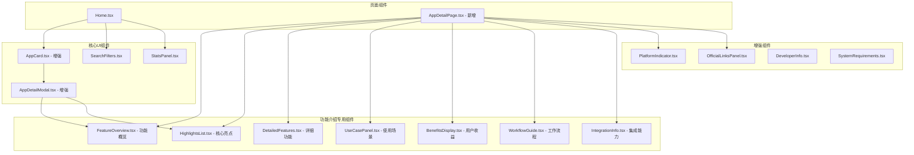
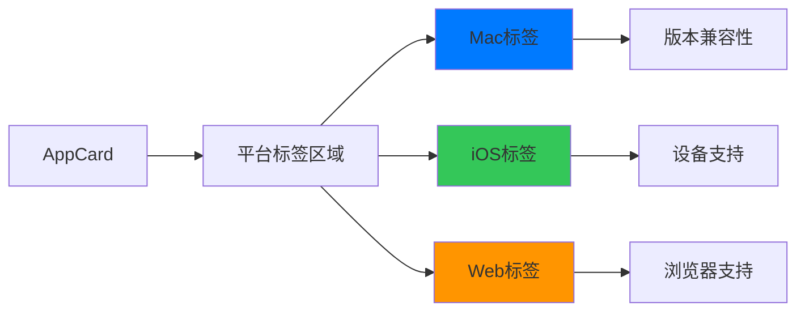
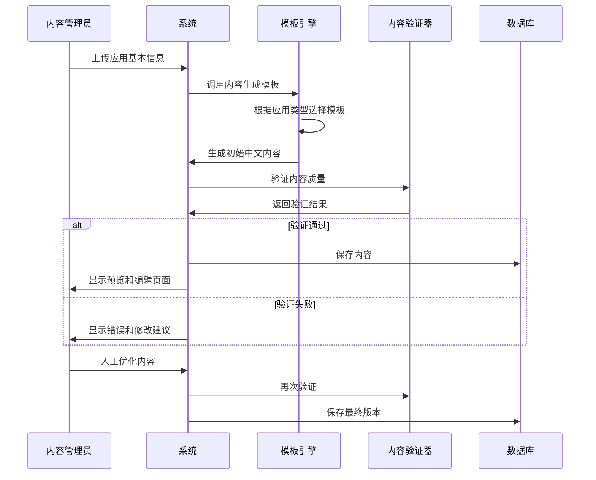
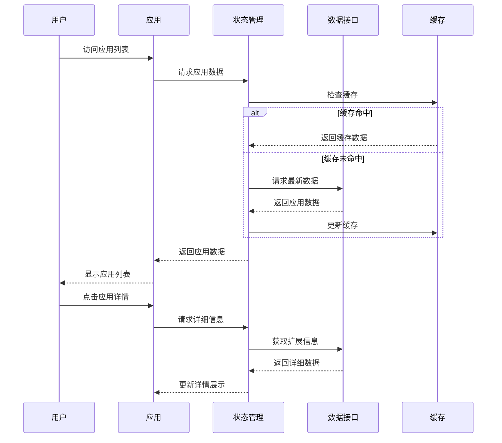

# Setapp Apps Showcase 功能完善设计

## 概述

本设计专注于在 APP 详情页面展示全面的中文功能介绍，对标 Setapp 官方内容标准。通过构建结构化的功能展示体系、专业的中文内容框架和丰富的交互体验，为用户提供深入了解每个应用功能特性的完整信息平台。

## 技术栈与依赖

基于现有技术栈进行增强：
- **前端框架**：React 18.3.1 + TypeScript 5.6.2
- **构建工具**：Vite 6.0.1
- **样式框架**：Tailwind CSS 3.4.17
- **状态管理**：Zustand 5.0.2
- **数据处理**：Papa Parse 5.4.1
- **路由管理**：React Router DOM 7.8.2

## 组件架构

### 数据模型增强

```typescript
// 扩展现有 App 接口，专注于中文功能介绍
export interface App {
  名称: string;
  功能描述: string;
  Setapp链接?: string;
  官方网站?: string;
  官方订阅价格: number | string;
  评分: number;
  平台: string;
  
  // 新增：中文功能介绍体系
  功能介绍: AppFeatureDescription; // 核心功能介绍结构
  开发者?: string;
  应用分类?: string;
  最后更新?: string;
  应用大小?: string;
  系统要求?: string;
  支持平台?: PlatformSupport;
}

// 新增：对标 Setapp 的中文功能介绍结构
export interface AppFeatureDescription {
  应用概述: string; // 一句话精准概述（30-50字）
  核心亮点: FeatureHighlight[]; // 3-5个主要功能亮点
  详细功能: DetailedFeature[]; // 详细功能模块说明
  使用场景: UseCase[]; // 适用场景和用户群体
  专业特性: ProfessionalFeature[]; // 技术特点和性能优势
  用户收益: UserBenefit[]; // 解决的问题和带来的价值
  工作流程?: WorkflowStep[]; // 典型的使用流程
  集成能力?: IntegrationCapability[]; // 与其他工具的集成
}

// 功能亮点
export interface FeatureHighlight {
  标题: string; // 亮点名称（10-15字）
  描述: string; // 详细说明（30-60字）
  图标?: string; // 对应图标
  重要程度: 'high' | 'medium' | 'low'; // 重要程度
}

// 详细功能模块
export interface DetailedFeature {
  模块名称: string;
  功能说明: string; // 100-200字的详细说明
  子功能?: SubFeature[]; // 子功能列表
  技术特点?: string[]; // 技术实现特点
  操作示例?: string; // 使用示例
}

// 使用场景
export interface UseCase {
  场景名称: string;
  适用人群: string; // 目标用户群体
  问题描述: string; // 解决的具体问题
  解决方案: string; // 如何解决
  效果展示?: string; // 预期效果
}

// 专业特性
export interface ProfessionalFeature {
  特性名称: string;
  技术说明: string;
  性能优势: string;
  对比优势?: string; // 与竞品的对比
}

// 用户收益
export interface UserBenefit {
  收益类型: 'efficiency' | 'quality' | 'cost' | 'experience'; // 收益类型
  收益描述: string;
  量化指标?: string; // 可量化的收益
}

// 工作流程步骤
export interface WorkflowStep {
  步骤序号: number;
  步骤名称: string;
  操作说明: string;
  注意事项?: string;
}

// 集成能力
export interface IntegrationCapability {
  集成对象: string; // 集成的工具或平台
  集成方式: string; // 集成方法
  集成效果: string; // 集成后的效果
}
```

### 组件层次结构



### AppCard 组件增强

#### 组件属性扩展
```typescript
interface AppCardProps {
  app: App;
  viewMode?: 'grid' | 'list';
  showPlatformDetails?: boolean; // 新增：是否显示详细平台信息
  onPlatformClick?: (platform: string) => void; // 新增：平台点击回调
}
```

#### 平台信息展示


#### 功能描述优化
- **简要描述**：在卡片中显示核心功能概述（50-80字符）
- **详细描述**：点击展开或跳转详情页查看完整功能介绍
- **关键词高亮**：自动识别并高亮功能关键词

### AppDetailModal 组件增强

#### 中文功能介绍体系设计
为了对标 Setapp 的内容标准，设计分层次的中文功能介绍体系：

```mermaid
flowchart TD
    A[应用详情页面] --> B[应用概览区]
    A --> C[核心亮点区]
    A --> D[详细功能区]
    A --> E[使用场景区]
    A --> F[专业特性区]
    A --> G[用户收益区]
    A --> H[工作流程区]
    A --> I[集成能力区]
    
    B --> B1[一句话精准概述]
    B --> B2[应用分类标签]
    B --> B3[目标用户群体]
    
    C --> C1[3-5个核心亮点]
    C --> C2[每个亮点包含图标]
    C --> C3[简洁有力的描述]
    
    D --> D1[功能模块化展示]
    D --> D2[每个模块详细说明]
    D --> D3[技术实现特点]
    D --> D4[操作示例演示]
    
    E --> E1[多种应用场景]
    E --> E2[目标人群匹配]
    E --> E3[问题解决方案]
    
    F --> F1[技术优势展示]
    F --> F2[性能指标对比]
    F --> F3[竞品差异化]
    
    G --> G1[效率提升]
    G --> G2[成本节约]
    G --> G3[体验优化]
    G --> G4[量化效果]
    
    H --> H1[典型操作流程]
    H --> H2[步骤分解说明]
    H --> H3[注意事项提示]
    
    I --> I1[支持的集成工具]
    I --> I2[集成方式说明]
    I --> I3[集成后的效果]
```



#### 内容标准化规范
为确保与 Setapp 官方内容的一致性，制定以下中文内容标准：

##### 语言风格
- **专业精准**：使用专业的技术语言，避免太过口语化
- **简洁明了**：表达简洁有力，突出重点
- **用户导向**：从用户视角出发，关注实际价值
- **积极正面**：使用积极语言，强调优势和收益

##### 内容结构
```typescript
// 内容模板结构
interface ContentTemplate {
  应用概述: {
    字数范围: '30-50字';
    要求: '精准概括核心价值，一句话说明应用作用';
  };
  核心亮点: {
    数量: '3-5个';
    每个标题: '8-15字';
    每个描述: '25-45字';
    要求: '突出差异化优势，使用行动导向语言';
  };
  详细功能: {
    模块数量: '4-8个';
    每模块说明: '80-150字';
    要求: '系统性介绍功能模块，包含技术特点';
  };
}
```

#### UI结构重新设计

```mermaid
flowchart TD
    A[模态框容器] --> B[头部信息区]
    A --> C[应用概览区]
    A --> D[核心亮点区]
    A --> E[详细功能区]
    A --> F[使用场景区]
    A --> G[专业特性区]
    A --> H[用户收益区]
    A --> I[工作流程区]
    A --> J[集成能力区]
    A --> K[平台支持区]
    A --> L[系统要求区]
    A --> M[开发者信息区]
    A --> N[操作按钮区]
    
    B --> B1[应用图标]
    B --> B2[应用名称]
    B --> B3[开发者]
    B --> B4[星级评分]
    B --> B5[应用分类]
    
    C --> C1[精准概述]
    C --> C2[目标用户]
    C --> C3[价值定位]
    
    D --> D1[亮点列表]
    D --> D2[图标展示]
    D --> D3[重要程度标识]
    
    E --> E1[功能模块卡片]
    E --> E2[模块详细说明]
    E --> E3[技术特点展示]
    E --> E4[操作示例]
    
    F --> F1[场景卡片集合]
    F --> F2[适用人群标签]
    F --> F3[问题解决路径]
    
    G --> G1[技术优势列表]
    G --> G2[性能指标]
    G --> G3[对比优势]
    
    H --> H1[收益类型分类]
    H --> H2[量化数据展示]
    H --> H3[效果预期]
    
    I --> I1[流程步骤图]
    I --> I2[步骤详细说明]
    I --> I3[注意事项]
    
    J --> J1[集成工具列表]
    J --> J2[集成方式图示]
    J --> J3[集成效果展示]
```


## 功能介绍组件设计

### FeatureOverview 组件（功能概览）

#### 组件功能
- **应用概述展示**：显示精炼的一句话描述
- **目标用户标识**：明确适用人群
- **价值定位**：突出核心价值主张

```typescript
interface FeatureOverviewProps {
  应用概述: string;
  目标用户: string[];
  核心价值: string;
  应用分类: string;
}

const FeatureOverview: React.FC<FeatureOverviewProps> = ({
  应用概述,
  目标用户,
  核心价值,
  应用分类
}) => {
  return (
    <div className="bg-gradient-to-r from-blue-50 to-indigo-50 p-6 rounded-xl mb-6">
      {/* 应用概述 */}
      <h3 className="text-xl font-bold text-gray-900 mb-4">功能概览</h3>
      <p className="text-lg text-gray-800 leading-relaxed mb-4">
        {应用概述}
      </p>
      
      {/* 目标用户标签 */}
      <div className="flex flex-wrap gap-2 mb-4">
        <span className="text-sm text-gray-600">适用于：</span>
        {目标用户.map((user, index) => (
          <span 
            key={index}
            className="px-3 py-1 bg-blue-100 text-blue-800 rounded-full text-sm font-medium"
          >
            {user}
          </span>
        ))}
      </div>
      
      {/* 核心价值 */}
      <div className="bg-white p-4 rounded-lg shadow-sm">
        <h4 className="font-semibold text-gray-900 mb-2">核心价值</h4>
        <p className="text-gray-700">{核心价值}</p>
      </div>
    </div>
  );
};
```

### HighlightsList 组件（核心亮点）

#### 组件功能
- **亮点卡片展示**：以卡片形式展示 3-5 个核心亮点
- **图标视觉化**：每个亮点配合相应图标
- **重要程度标识**：通过视觉层次区分重要程度

```typescript
interface HighlightsListProps {
  highlights: FeatureHighlight[];
  layout?: 'grid' | 'list';
}

const HighlightsList: React.FC<HighlightsListProps> = ({ 
  highlights, 
  layout = 'grid' 
}) => {
  const getImportanceStyle = (importance: string) => {
    switch (importance) {
      case 'high':
        return 'border-l-4 border-l-red-500 bg-red-50';
      case 'medium':
        return 'border-l-4 border-l-yellow-500 bg-yellow-50';
      default:
        return 'border-l-4 border-l-green-500 bg-green-50';
    }
  };
  
  return (
    <div className="mb-8">
      <h3 className="text-xl font-bold text-gray-900 mb-6">核心亮点</h3>
      <div className={`grid gap-4 ${
        layout === 'grid' ? 'md:grid-cols-2 lg:grid-cols-3' : 'grid-cols-1'
      }`}>
        {highlights.map((highlight, index) => (
          <div 
            key={index}
            className={`p-5 rounded-lg shadow-sm hover:shadow-md transition-shadow ${
              getImportanceStyle(highlight.重要程度)
            }`}
          >
            <div className="flex items-start space-x-3">
              {highlight.图标 && (
                <div className="flex-shrink-0">
                  
                </div>
              )}
              <div className="flex-1">
                <h4 className="font-semibold text-gray-900 mb-2">
                  {highlight.标题}
                </h4>
                <p className="text-gray-700 text-sm leading-relaxed">
                  {highlight.描述}
                </p>
              </div>
            </div>
          </div>
        ))}
      </div>
    </div>
  );
};
```

### DetailedFeatures 组件（详细功能）

#### 组件功能
- **模块化展示**：将功能按模块组织展示
- **技术特点高亮**：突出技术实现亮点
- **操作示例**：提供具体的使用示例

```typescript
interface DetailedFeaturesProps {
  features: DetailedFeature[];
  expandable?: boolean;
}

const DetailedFeatures: React.FC<DetailedFeaturesProps> = ({ 
  features, 
  expandable = true 
}) => {
  const [expandedModules, setExpandedModules] = useState<Set<number>>(new Set());
  
  const toggleExpand = (index: number) => {
    const newExpanded = new Set(expandedModules);
    if (newExpanded.has(index)) {
      newExpanded.delete(index);
    } else {
      newExpanded.add(index);
    }
    setExpandedModules(newExpanded);
  };
  
  return (
    <div className="mb-8">
      <h3 className="text-xl font-bold text-gray-900 mb-6">详细功能</h3>
      <div className="space-y-4">
        {features.map((feature, index) => {
          const isExpanded = expandedModules.has(index);
          
          return (
            <div 
              key={index} 
              className="border border-gray-200 rounded-lg overflow-hidden"
            >
              {/* 模块头部 */}
              <div 
                className="p-4 bg-gray-50 cursor-pointer flex justify-between items-center"
                onClick={() => expandable && toggleExpand(index)}
              >
                <h4 className="font-semibold text-gray-900">
                  {feature.模块名称}
                </h4>
                {expandable && (
                  <ChevronDown 
                    className={`w-5 h-5 text-gray-500 transition-transform ${
                      isExpanded ? 'rotate-180' : ''
                    }`} 
                  />
                )}
              </div>
              
              {/* 模块内容 */}
              <div className={`${
                expandable && !isExpanded ? 'hidden' : 'block'
              }`}>
                <div className="p-4">
                  <p className="text-gray-700 mb-4 leading-relaxed">
                    {feature.功能说明}
                  </p>
                  
                  {/* 子功能 */}
                  {feature.子功能 && feature.子功能.length > 0 && (
                    <div className="mb-4">
                      <h5 className="font-medium text-gray-900 mb-2">子功能：</h5>
                      <ul className="list-disc list-inside space-y-1 text-sm text-gray-600">
                        {feature.子功能.map((sub, subIndex) => (
                          <li key={subIndex}>{sub}</li>
                        ))}
                      </ul>
                    </div>
                  )}
                  
                  {/* 技术特点 */}
                  {feature.技术特点 && feature.技术特点.length > 0 && (
                    <div className="mb-4">
                      <h5 className="font-medium text-gray-900 mb-2">技术特点：</h5>
                      <div className="flex flex-wrap gap-2">
                        {feature.技术特点.map((tech, techIndex) => (
                          <span 
                            key={techIndex}
                            className="px-3 py-1 bg-blue-100 text-blue-800 rounded-full text-xs font-medium"
                          >
                            {tech}
                          </span>
                        ))}
                      </div>
                    </div>
                  )}
                  
                  {/* 操作示例 */}
                  {feature.操作示例 && (
                    <div className="bg-gray-50 p-3 rounded-md">
                      <h5 className="font-medium text-gray-900 mb-2">操作示例：</h5>
                      <p className="text-sm text-gray-600">{feature.操作示例}</p>
                    </div>
                  )}
                </div>
              </div>
            </div>
          );
        })}
      </div>
    </div>
  );
};
```

### UseCasePanel 组件（使用场景）

#### 组件功能
- **场景卡片展示**：以卡片形式展示不同使用场景
- **人群匹配**：明确每个场景的适用人群
- **问题解决链路**：展示从问题到解决的完整路径

```typescript
interface UseCasePanelProps {
  useCases: UseCase[];
  interactive?: boolean;
}

const UseCasePanel: React.FC<UseCasePanelProps> = ({ 
  useCases, 
  interactive = false 
}) => {
  const [selectedCase, setSelectedCase] = useState<number | null>(null);
  
  return (
    <div className="mb-8">
      <h3 className="text-xl font-bold text-gray-900 mb-6">使用场景</h3>
      <div className="grid gap-6 md:grid-cols-2">
        {useCases.map((useCase, index) => (
          <div 
            key={index}
            className={`border rounded-lg p-5 transition-all ${
              interactive && selectedCase === index
                ? 'border-blue-500 bg-blue-50 shadow-md'
                : 'border-gray-200 hover:shadow-sm'
            }`}
            onClick={() => interactive && setSelectedCase(
              selectedCase === index ? null : index
            )}
          >
            {/* 场景标题 */}
            <div className="flex items-center justify-between mb-3">
              <h4 className="font-semibold text-gray-900">
                {useCase.场景名称}
              </h4>
              <span className="px-2 py-1 bg-green-100 text-green-800 rounded text-xs font-medium">
                {useCase.适用人群}
              </span>
            </div>
            
            {/* 问题描述 */}
            <div className="mb-3">
              <h5 className="text-sm font-medium text-gray-700 mb-1">遇到的问题：</h5>
              <p className="text-sm text-gray-600">{useCase.问题描述}</p>
            </div>
            
            {/* 解决方案 */}
            <div className="mb-3">
              <h5 className="text-sm font-medium text-gray-700 mb-1">解决方案：</h5>
              <p className="text-sm text-gray-600">{useCase.解决方案}</p>
            </div>
            
            {/* 效果展示 */}
            {useCase.效果展示 && (
              <div className="bg-green-50 p-3 rounded-md">
                <h5 className="text-sm font-medium text-green-800 mb-1">预期效果：</h5>
                <p className="text-sm text-green-700">{useCase.效果展示}</p>
              </div>
            )}
          </div>
        ))}
      </div>
    </div>
  );
};
```

## 中文内容管理体系

### 内容数据结构设计

#### 扩展 CSV 数据模式
基于现有的 `apps_list_enhanced_descriptions.csv`，扩展为更丰富的中文内容结构：

```csv
名称,功能描述,Setapp链接,官方网站,官方订阅价格,评分,平台,应用概述,核心亮点_1,核心亮点_2,核心亮点_3,详细功能_模块_1,详细功能_模块_2,使用场景_1,使用场景_2,专业特性_1,用户收益_1,开发者,应用分类
```

#### 内容组织结构
```typescript
// 单个应用的中文内容结构
interface AppChineseContent {
  基本信息: {
    应用概述: string; // 30-50字的精准概述
    目标用户: string[]; // ['设计师', '开发者', '创作者']
    核心价值: string; // 一句话价值主张
    应用分类: string; // '设计工具', '开发工具'
  };
  
  核心亮点: {
    智能特性: FeatureHighlight;
    性能优势: FeatureHighlight;
    易用性: FeatureHighlight;
    集成能力?: FeatureHighlight;
    特色功能?: FeatureHighlight;
  };
  
  功能模块: {
    核心功能: DetailedFeature;
    高级功能: DetailedFeature;
    管理功能?: DetailedFeature;
    协作功能?: DetailedFeature;
  };
  
  应用场景: {
    个人用户: UseCase;
    专业用户: UseCase;
    团队使用?: UseCase;
    企业部署?: UseCase;
  };
  
  技术特性: {
    核心技术: ProfessionalFeature;
    性能优化: ProfessionalFeature;
    安全特性?: ProfessionalFeature;
  };
  
  用户收益: {
    效率提升: UserBenefit;
    成本节约: UserBenefit;
    体验优化: UserBenefit;
  };
  
  工作流程?: WorkflowStep[];
  集成能力?: IntegrationCapability[];
}
```

### 内容生成模板

#### Setapp 风格内容模板
为确保与 Setapp 官方内容风格一致，制定以下模板：

```typescript
// 以 CleanShot X 为例的内容模板
const cleanShotXTemplate: AppChineseContent = {
  基本信息: {
    应用概述: '功能强大的截图和屏幕录制工具，提供专业级的编辑功能和云端分享体验',
    目标用户: ['设计师', '开发者', '内容创作者', '教育工作者'],
    核心价值: '让截图和屏幕录制变得简单高效，提供专业的视觉效果',
    应用分类: '截图工具'
  },
  
  核心亮点: {
    智能特性: {
      标题: '智能截图识别',
      描述: '自动识别窗口边界，精准捕捉指定区域，支持滚动截图和网页全屏',
      图标: '/icons/smart-capture.svg',
      重要程度: 'high'
    },
    性能优势: {
      标题: '高效编辑工具',
      描述: '内置丰富的标注工具，支持文字、箭头、模糊处理等，一站式完成编辑',
      图标: '/icons/edit-tools.svg',
      重要程度: 'high'
    },
    易用性: {
      标题: '一键分享云端',
      描述: '快速上传至云端，生成分享链接，支持自定义域名和密码保护',
      图标: '/icons/cloud-share.svg',
      重要程度: 'medium'
    },
    特色功能: {
      标题: 'GIF 动画制作',
      描述: '直接将屏幕录制转换为高质量 GIF 动画，支持帧率调节和大小优化',
      图标: '/icons/gif-maker.svg',
      重要程度: 'medium'
    }
  },
  
  功能模块: {
    核心功能: {
      模块名称: '截图和录制',
      功能说明: '提供多种截图模式，包括区域截图、窗口截图、全屏截图和滚动截图。支持高清屏幕录制，自动优化音频质量。内置定时器和倒计时功能，精准控制录制时机。',
      子功能: ['智能窗口识别', '滚动截图', '定时截图', '高清录制'],
      技术特点: ['像素级精度', 'GPU 加速', '低延迟录制'],
      操作示例: '按下 Cmd+Shift+3 即可开始截图，拖拽选择区域后自动进入编辑模式'
    },
    高级功能: {
      模块名称: '编辑和标注',
      功能说明: '提供专业级的编辑工具，包括文字添加、箭头指示、形状绘制、高亮标记、模糊处理等。支持自定义样式和模板，一键应用品牌标识。内置丰富的颜色选择和字体设置。',
      子功能: ['标注工具', '样式模板', '品牌水印', '批量处理'],
      技术特点: ['实时预览', '无损编辑', '样式继承'],
      操作示例: '截图后立即进入编辑界面，点击工具栏添加标注，双击保存或分享'
    }
  },
  
  应用场景: {
    个人用户: {
      场景名称: '日常工作截图',
      适用人群: '个人用户',
      问题描述: '系统自带截图工具功能简陈，编辑能力有限，分享不便',
      解决方案: '使用 CleanShot X 实现一键截图、快速编辑和云端分享，大幅提升工作效率',
      效果展示: '截图效率提升 80%，编辑时间减少 60%'
    },
    专业用户: {
      场景名称: '产品文档制作',
      适用人群: '产品经理、技术写手',
      问题描述: '产品文档需要大量截图和标注，传统工具操作繁琐，效果不佳',
      解决方案: '利用智能截图和专业标注工具，快速制作高质量的产品文档',
      效果展示: '文档制作效率提升 3 倍，视觉效果明显改善'
    }
  },
  
  技术特性: {
    核心技术: {
      特性名称: '智能窗口识别技术',
      技术说明: '基于机器学习的窗口边界检测算法，能够精准识别各种应用窗口',
      性能优势: '识别精度达 99.5%，响应速度小于 100ms',
      对比优势: '相比系统自带工具，识别精度提升 40%'
    },
    性能优化: {
      特性名称: 'GPU 硬件加速',
      技术说明: '充分利用 Mac 的 GPU 资源进行视频编码和图像处理',
      性能优势: '视频处理速度提升 5-8 倍，显著降低 CPU 占用率',
      对比优势: '在同类工具中性能领先，电池消耗更低'
    }
  },
  
  用户收益: {
    效率提升: {
      收益类型: 'efficiency',
      收益描述: '通过智能化操作和一体化工作流，显著提升截图和编辑效率',
      量化指标: '截图效率提升 80%，编辑时间减少 60%'
    },
    成本节约: {
      收益类型: 'cost',
      收益描述: '替代多个专业工具，减少软件购买和维护成本',
      量化指标: '每年节约软件成本超过 $200'
    },
    体验优化: {
      收益类型: 'experience',
      收益描述: '简化操作流程，提供一致性的高质量体验',
      量化指标: '用户满意度 95%，学习成本降低 70%'
    }
  }
};
```

### 内容生成工作流

#### 自动化内容生成


#### 内容质量控制
```typescript
interface ContentQualityChecker {
  // 语言质量检查
  checkLanguageQuality(content: string): {
    score: number; // 0-100 分
    issues: string[]; // 问题列表
    suggestions: string[]; // 改进建议
  };
  
  // 内容完整性检查
  checkContentCompleteness(content: AppChineseContent): {
    missing: string[]; // 缺少的必要字段
    incomplete: string[]; // 不完整的字段
    recommendations: string[]; // 优化建议
  };
  
  // Setapp 风格一致性检查
  checkSetappStyleConsistency(content: AppChineseContent): {
    styleScore: number;
    inconsistencies: string[];
    styleRecommendations: string[];
  };
}
```

## 状态管理增强

### Zustand Store 扩展
```typescript
interface AppStoreState {
  // 现有状态
  apps: App[];
  filteredApps: App[];
  selectedApp: App | null;
  loading: boolean;
  error: string | null;
  
  // 新增状态
  appDetails: Record<string, AppDetailInfo>; // 应用详细信息缓存
  platformFilters: string[]; // 当前选中的平台筛选
  categoryFilters: string[]; // 当前选中的分类筛选
  developerInfo: Record<string, DeveloperInfo>; // 开发者信息缓存
  userPreferences: UserPreferences; // 用户偏好设置
  recentlyViewed: App[]; // 最近浏览的应用
  bookmarkedApps: string[]; // 收藏的应用
  
  // 新增操作
  setAppDetails: (appName: string, details: AppDetailInfo) => void;
  togglePlatformFilter: (platform: string) => void;
  toggleCategoryFilter: (category: string) => void;
  addToRecentlyViewed: (app: App) => void;
  toggleBookmark: (appName: string) => void;
  setUserPreferences: (preferences: Partial<UserPreferences>) => void;
}
```

### 数据加载策略


## API 集成层

### 数据源整合
```typescript
interface DataService {
  // 基础应用数据
  loadAppsFromCSV(): Promise<App[]>;
  
  // 扩展信息获取
  fetchAppDetails(appName: string): Promise<AppDetailInfo>;
  fetchDeveloperInfo(developer: string): Promise<DeveloperInfo>;
  fetchAppScreenshots(appName: string): Promise<string[]>;
  
  // 链接验证
  verifyOfficialLinks(app: App): Promise<LinkVerificationResult>;
  
  // 实时数据
  fetchLatestAppInfo(appName: string): Promise<Partial<App>>;
  fetchUserReviews(appName: string): Promise<UserReview[]>;
}
```

### 链接验证服务
```typescript
interface LinkVerificationService {
  verifyLink(url: string): Promise<{
    valid: boolean;
    statusCode: number;
    redirectUrl?: string;
    lastChecked: Date;
  }>;
  
  batchVerifyLinks(urls: string[]): Promise<Map<string, boolean>>;
  
  schedulePeriodicCheck(urls: string[], interval: number): void;
}
```

## 测试策略

### 中文内容测试
```typescript
// 中文内容质量测试
describe('中文功能介绍内容', () => {
  it('应用概述应符合字数要求', () => {
    const 概述 = '功能强大的截图和屏幕录制工具，提供专业级的编辑功能和云端分享体验';
    expect(概述.length).toBeGreaterThanOrEqual(30);
    expect(概述.length).toBeLessThanOrEqual(50);
  });
  
  it('核心亮点应包含 3-5 个项目', () => {
    const highlights = [
      { 标题: '智能截图', 描述: '...' },
      { 标题: '专业编辑', 描述: '...' },
      { 标题: '云端分享', 描述: '...' }
    ];
    expect(highlights.length).toBeGreaterThanOrEqual(3);
    expect(highlights.length).toBeLessThanOrEqual(5);
  });
  
  it('每个亮点描述应符合长度要求', () => {
    const 描述 = '自动识别窗口边界，精准捕捉指定区域';
    expect(描述.length).toBeGreaterThanOrEqual(25);
    expect(描述.length).toBeLessThanOrEqual(45);
  });
});

// Setapp 风格一致性测试
describe('Setapp 风格一致性', () => {
  it('应使用专业术语', () => {
    const content = '功能强大的截图工具，提供专业级的编辑功能';
    expect(content).toMatch(/专业|高级|智能|高效/);
  });
  
  it('应突出用户价值', () => {
    const benefits = ['效率提升', '成本节约', '体验优化'];
    expect(benefits.every(benefit => 
      benefit.includes('提升') || 
      benefit.includes('节约') || 
      benefit.includes('优化')
    )).toBe(true);
  });
});
```

### 组件测试
```typescript
// FeatureOverview 组件测试
describe('FeatureOverview', () => {
  it('应正确显示应用概述', () => {
    const 概述 = '功能强大的截图工具';
    render(<FeatureOverview 应用概述={概述} />);
    expect(screen.getByText(概述)).toBeInTheDocument();
  });
  
  it('应显示目标用户标签', () => {
    const 目标用户 = ['设计师', '开发者'];
    render(<FeatureOverview 目标用户={目标用户} />);
    
    目标用户.forEach(用户 => {
      expect(screen.getByText(用户)).toBeInTheDocument();
    });
  });
});

// DetailedFeatures 组件测试
describe('DetailedFeatures', () => {
  const mockFeatures = [
    {
      模块名称: '截图功能',
      功能说明: '提供多种截图模式',
      技术特点: ['智能识别', 'GPU加速']
    }
  ];
  
  it('应显示所有功能模块', () => {
    render(<DetailedFeatures features={mockFeatures} />);
    expect(screen.getByText('截图功能')).toBeInTheDocument();
  });
  
  it('应支持模块展开收起', () => {
    render(<DetailedFeatures features={mockFeatures} expandable={true} />);
    
    const moduleHeader = screen.getByText('截图功能');
    fireEvent.click(moduleHeader);
    
    expect(screen.getByText('提供多种截图模式')).toBeVisible();
  });
  
  it('应显示技术特点标签', () => {
    render(<DetailedFeatures features={mockFeatures} />);
    expect(screen.getByText('智能识别')).toBeInTheDocument();
    expect(screen.getByText('GPU加速')).toBeInTheDocument();
  });
});
```

### 内容质量测试
```typescript
// 内容完整性测试
describe('应用内容完整性', () => {
  const apps = loadAppsData();
  
  it('所有应用都应有中文功能介绍', () => {
    apps.forEach(app => {
      expect(app.功能介绍).toBeDefined();
      expect(app.功能介绍.应用概述).toBeTruthy();
      expect(app.功能介绍.核心亮点).toHaveLength.toBeGreaterThanOrEqual(3);
    });
  });
  
  it('所有功能描述都应为中文', () => {
    apps.forEach(app => {
      const 中文正则 = /[\u4e00-\u9fff]/;
      expect(app.功能描述).toMatch(中文正则);
      expect(app.功能介绍.应用概述).toMatch(中文正则);
    });
  });
  
  it('所有应用都应有官方链接或Setapp链接', () => {
    apps.forEach(app => {
      expect(
        app.官方网站 || app.Setapp链接
      ).toBeTruthy();
    });
  });
});
```