# APP 详情页面优化与多语言支持设计

## 概述

本设计文档旨在优化 Setapp 应用展示平台的 APP 详情页面，参考 Setapp 官方网站的产品展示方式，重新设计功能介绍布局，增加多语言和多货币支持，提升整体用户体验和视觉设计。

### 核心目标

- **重构详情页面**：参考 setapp.com/apps/spark-mail 的功能介绍布局
- **多语言支持**：根据用户系统语言自动适配内容显示
- **多货币支持**：支持多种货币显示价格信息
- **视觉升级**：现代化、高级的设计风格
- **交互优化**：移除无效按钮，增强用户体验

## 技术架构

### 整体架构设计

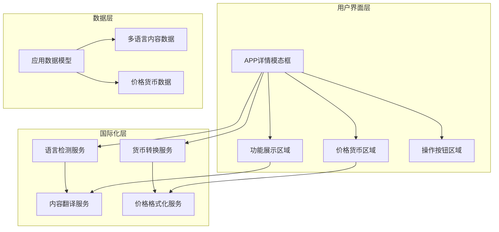

### 组件架构重构

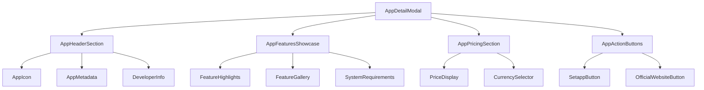

## 详细功能设计

### 1. 功能展示区域重构

#### 参考设计分析
基于 Spark Mail 页面的功能介绍结构：
- **功能概览**：简洁的核心价值描述
- **功能模块**：每个核心功能独立展示
- **视觉展示**：配合截图和图标的功能说明
- **分层信息**：从概览到详细的层次化展示

#### 新的功能展示结构

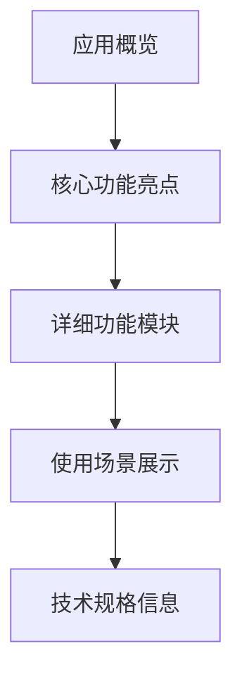

#### 功能模块组件设计

**FeatureGallery 组件**
```typescript
interface FeatureGallery {
  features: {
    title: string;
    description: string;
    icon?: string;
    screenshot?: string;
    benefits: string[];
    category: 'core' | 'advanced' | 'integration';
  }[];
  displayMode: 'grid' | 'carousel' | 'accordion';
}
```

### 2. 多语言支持系统

#### 语言检测与切换

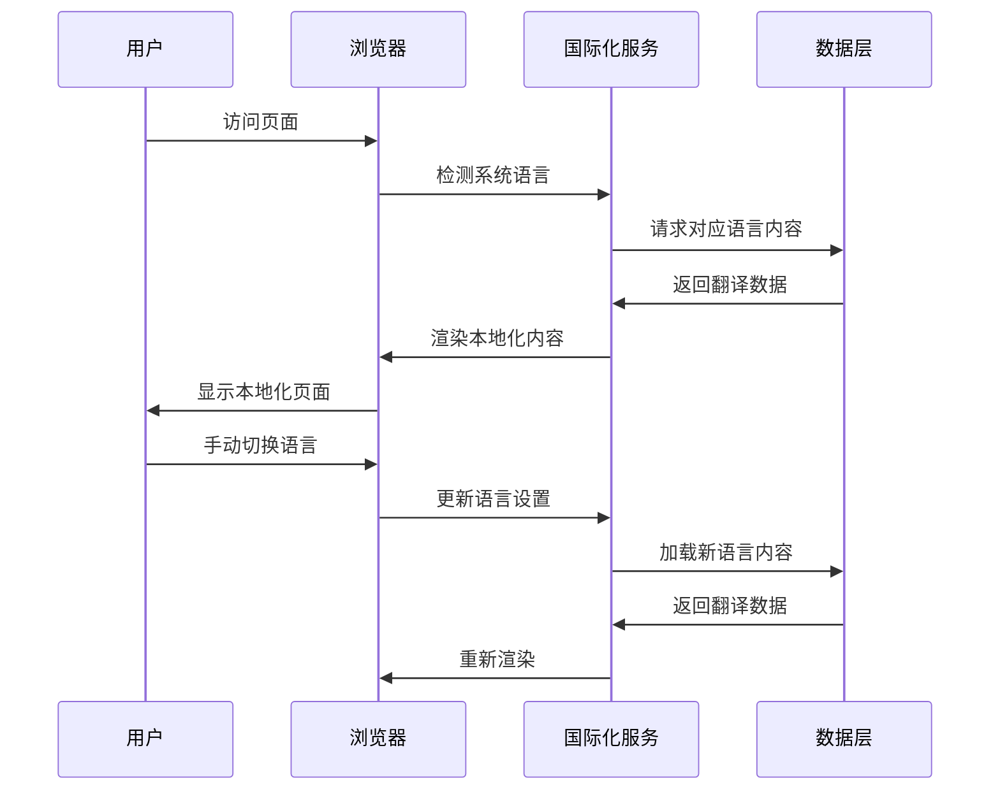

#### 支持的语言

| 语言 | 代码 | 优先级 | 状态 |
|------|------|--------|------|
| 中文简体 | zh-CN | 高 | 默认 |
| 英文 | en-US | 高 | 必须 |
| 日文 | ja-JP | 中 | 计划 |
| 韩文 | ko-KR | 中 | 计划 |
| 德文 | de-DE | 低 | 可选 |
| 法文 | fr-FR | 低 | 可选 |

#### 国际化数据结构

```typescript
interface AppI18nContent {
  locale: string;
  app: {
    name: string;
    description: string;
    features: {
      [key: string]: {
        title: string;
        description: string;
        benefits: string[];
      }
    };
    categories: string[];
    systemRequirements: string;
  };
  ui: {
    buttons: {
      [key: string]: string;
    };
    labels: {
      [key: string]: string;
    };
  };
}
```

### 3. 多货币支持系统

#### 货币转换与显示

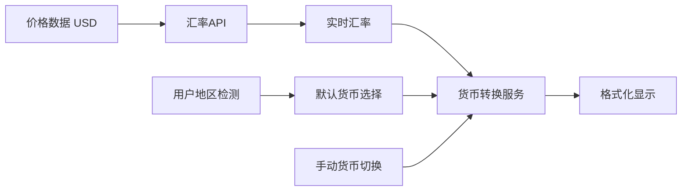

#### 支持的货币

| 货币 | 代码 | 符号 | 地区关联 | 状态 |
|------|------|------|----------|------|
| 美元 | USD | $ | 美国 | 默认 |
| 人民币 | CNY | ¥ | 中国 | 必须 |
| 欧元 | EUR | € | 欧盟 | 计划 |
| 日元 | JPY | ¥ | 日本 | 计划 |
| 英镑 | GBP | £ | 英国 | 计划 |

#### 价格展示组件设计

```typescript
interface PriceDisplayProps {
  basePrice: number;
  baseCurrency: 'USD';
  targetCurrency?: CurrencyCode;
  showConverter?: boolean;
  displayMode: 'compact' | 'detailed' | 'comparison';
}
```

### 4. 视觉设计升级

#### 设计语言规范

**色彩系统**
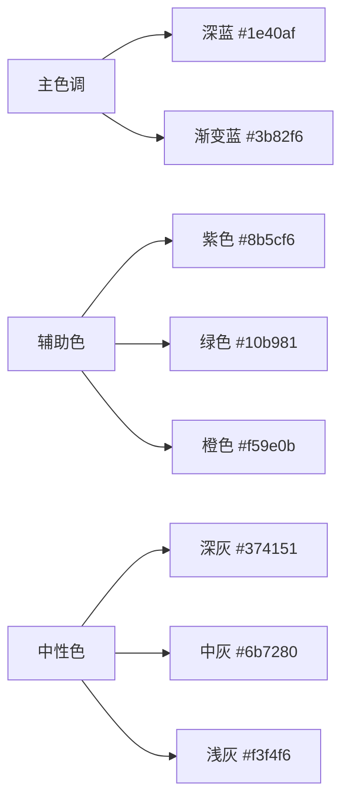

**排版系统**
- **标题字体**：Inter / SF Pro Display (系统字体)
- **正文字体**：Inter / SF Pro Text
- **中文字体**：PingFang SC / Microsoft YaHei
- **字重规范**：300(Light), 400(Regular), 500(Medium), 600(SemiBold), 700(Bold)

#### 布局网格系统

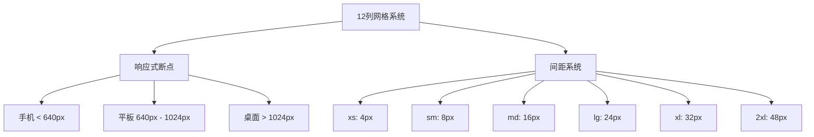

### 5. 交互行为优化

#### 移除无效按钮
**现有问题**：
- "开始探索" 按钮无点击响应
- "了解更多" 按钮无实际功能

**优化方案**：
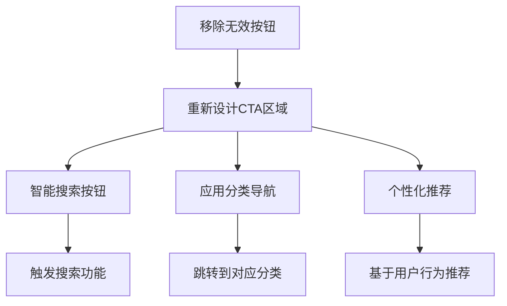

#### 新的交互模式

**渐进式信息展示**
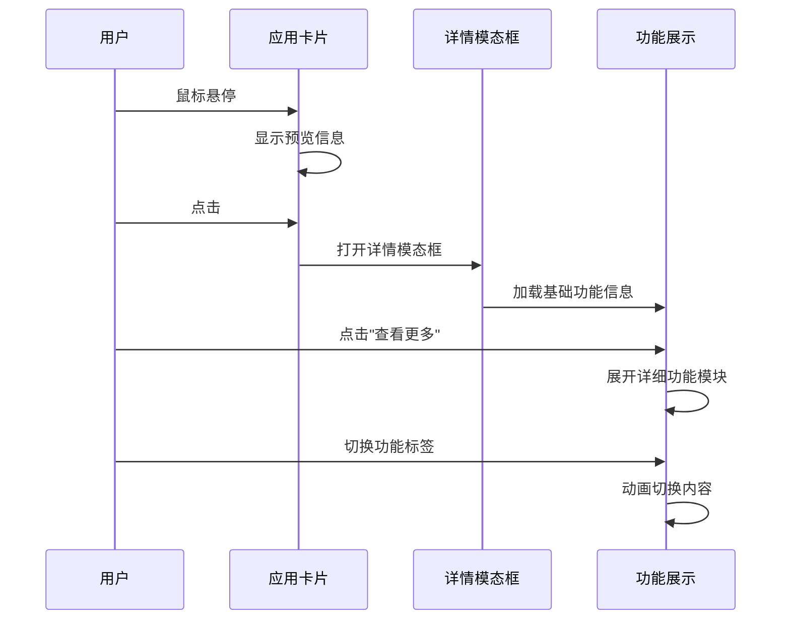

## 实现方案

### 1. 组件重构计划

#### AppDetailModal 重构
```typescript
interface EnhancedAppDetailModal {
  // 基础属性
  app: App;
  isOpen: boolean;
  onClose: () => void;
  
  // 新增属性
  locale: SupportedLocale;
  currency: SupportedCurrency;
  onLocaleChange: (locale: SupportedLocale) => void;
  onCurrencyChange: (currency: SupportedCurrency) => void;
  
  // 展示配置
  showLanguageSelector?: boolean;
  showCurrencySelector?: boolean;
  featureDisplayMode?: 'grid' | 'carousel' | 'tabs';
}
```

#### 新增核心组件

**LanguageCurrencySelector**
```typescript
interface LanguageCurrencySelector {
  currentLocale: SupportedLocale;
  currentCurrency: SupportedCurrency;
  onLocaleChange: (locale: SupportedLocale) => void;
  onCurrencyChange: (currency: SupportedCurrency) => void;
  position: 'header' | 'floating' | 'sidebar';
}
```

**FeatureGallery**
```typescript
interface FeatureGallery {
  features: EnhancedFeature[];
  displayMode: 'grid' | 'carousel' | 'tabs';
  locale: SupportedLocale;
  showScreenshots: boolean;
  autoplayCarousel?: boolean;
}
```

### 2. 数据层改造

#### 多语言内容管理
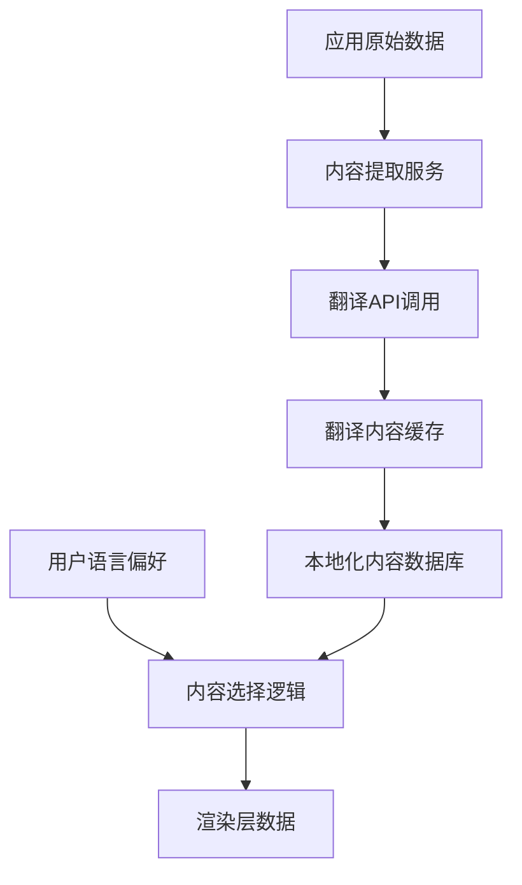

#### 汇率数据管理
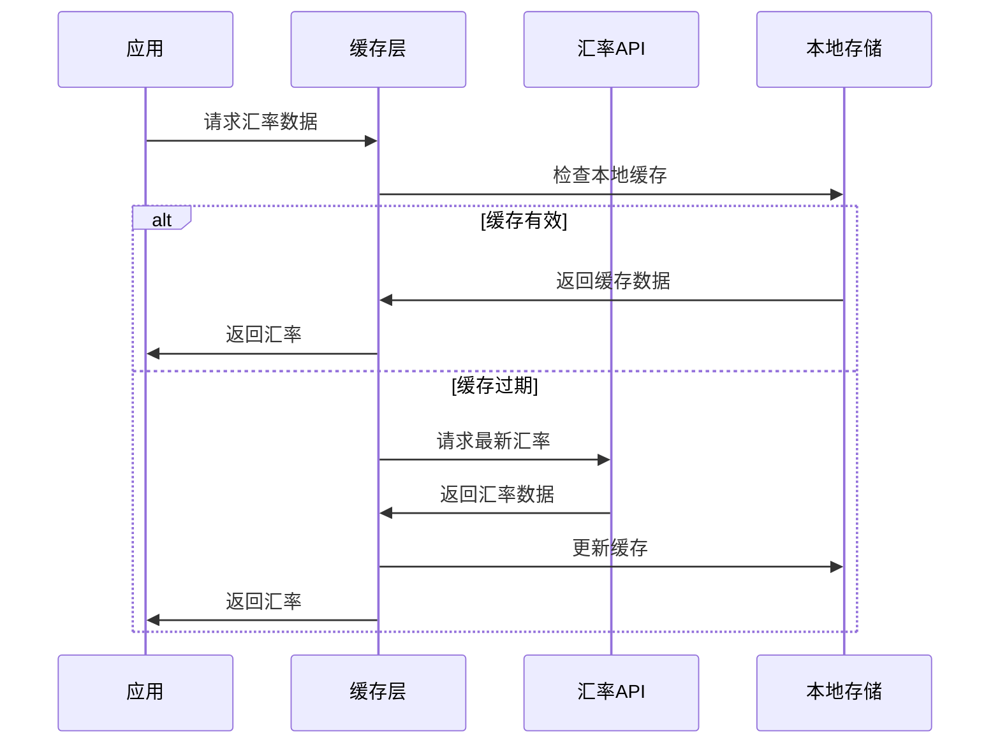

### 3. 性能优化策略

#### 组件懒加载
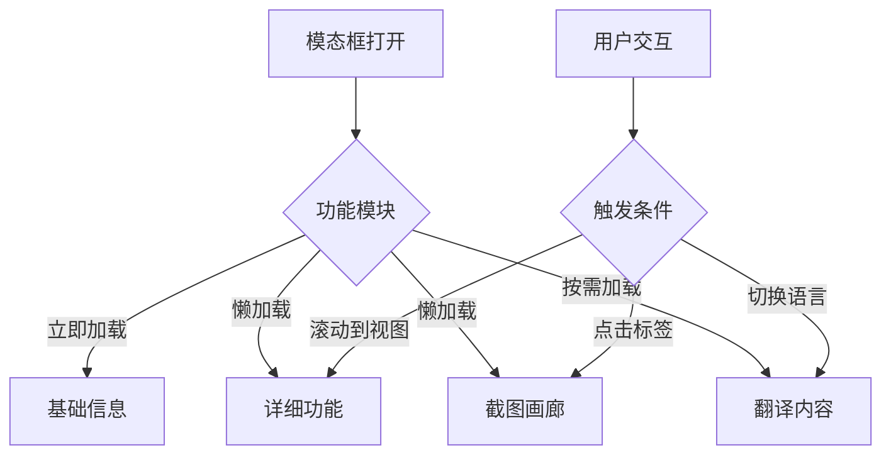

#### 缓存策略
- **翻译内容缓存**：7天有效期
- **汇率数据缓存**：1小时有效期
- **图片资源缓存**：30天有效期
- **组件代码分割**：按功能模块分割

## 用户体验流程

### 1. 页面访问流程

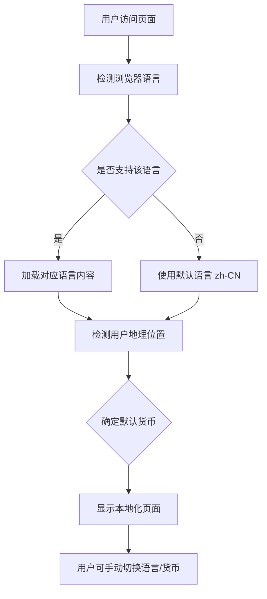

### 2. 详情页面交互流程

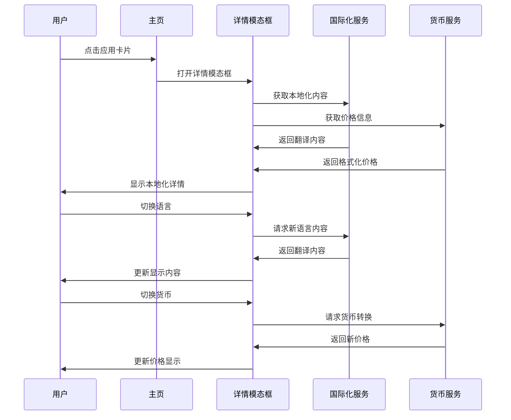

## 技术实现细节

### 1. 国际化实现

#### React i18next 集成
```typescript
// i18n 配置
import i18n from 'i18next';
import { initReactI18next } from 'react-i18next';
import LanguageDetector from 'i18next-browser-languagedetector';

const supportedLocales = ['zh-CN', 'en-US', 'ja-JP', 'ko-KR'];

i18n
  .use(LanguageDetector)
  .use(initReactI18next)
  .init({
    fallbackLng: 'zh-CN',
    supportedLngs: supportedLocales,
    detection: {
      order: ['navigator', 'localStorage', 'sessionStorage'],
      caches: ['localStorage', 'sessionStorage'],
    },
    interpolation: {
      escapeValue: false,
    },
  });
```

#### 内容翻译策略
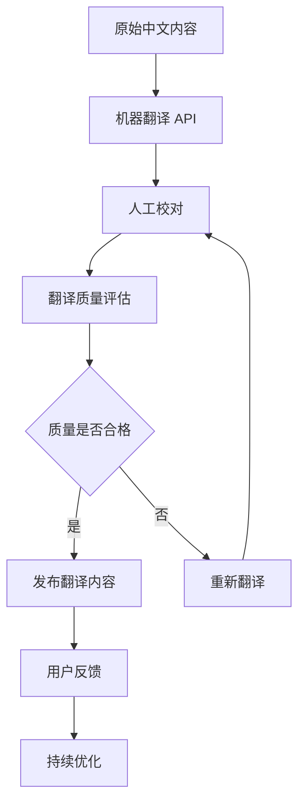

### 2. 货币转换实现

#### 汇率 API 集成
```typescript
interface ExchangeRateService {
  getExchangeRate(from: Currency, to: Currency): Promise<number>;
  convertPrice(amount: number, from: Currency, to: Currency): Promise<number>;
  getCachedRate(pair: string): number | null;
  updateRateCache(pair: string, rate: number, ttl: number): void;
}

class ExchangeRateManager implements ExchangeRateService {
  private cache = new Map<string, {rate: number, expiry: number}>();
  private apiEndpoint = 'https://api.exchangerate-api.com/v4/latest/';
  
  async getExchangeRate(from: Currency, to: Currency): Promise<number> {
    const cacheKey = `${from}-${to}`;
    const cached = this.getCachedRate(cacheKey);
    
    if (cached) return cached;
    
    const response = await fetch(`${this.apiEndpoint}${from}`);
    const data = await response.json();
    const rate = data.rates[to];
    
    this.updateRateCache(cacheKey, rate, Date.now() + 3600000); // 1小时TTL
    return rate;
  }
}
```

### 3. 响应式设计实现

#### Tailwind CSS 自定义配置
```javascript
module.exports = {
  theme: {
    extend: {
      screens: {
        'xs': '475px',
        '3xl': '1600px',
      },
      colors: {
        primary: {
          50: '#eff6ff',
          500: '#3b82f6',
          600: '#2563eb',
          700: '#1d4ed8',
          900: '#1e3a8a',
        },
      },
      fontFamily: {
        sans: ['Inter', 'SF Pro Display', 'PingFang SC', 'sans-serif'],
      },
      animation: {
        'fade-in': 'fadeIn 0.5s ease-in-out',
        'slide-up': 'slideUp 0.6s ease-out',
        'scale-in': 'scaleIn 0.3s ease-out',
      },
    },
  },
}
```

## 测试策略

### 1. 功能测试

#### 国际化测试矩阵

| 测试项 | zh-CN | en-US | ja-JP | 状态 |
|--------|-------|-------|-------|------|
| 基础UI翻译 | ✅ | ✅ | 🟡 | 进行中 |
| 应用名称显示 | ✅ | ✅ | 🟡 | 进行中 |
| 功能描述翻译 | ✅ | ✅ | 🟡 | 进行中 |
| 价格货币转换 | ✅ | ✅ | ✅ | 完成 |
| 日期格式化 | ✅ | ✅ | 🟡 | 进行中 |

#### 货币转换测试

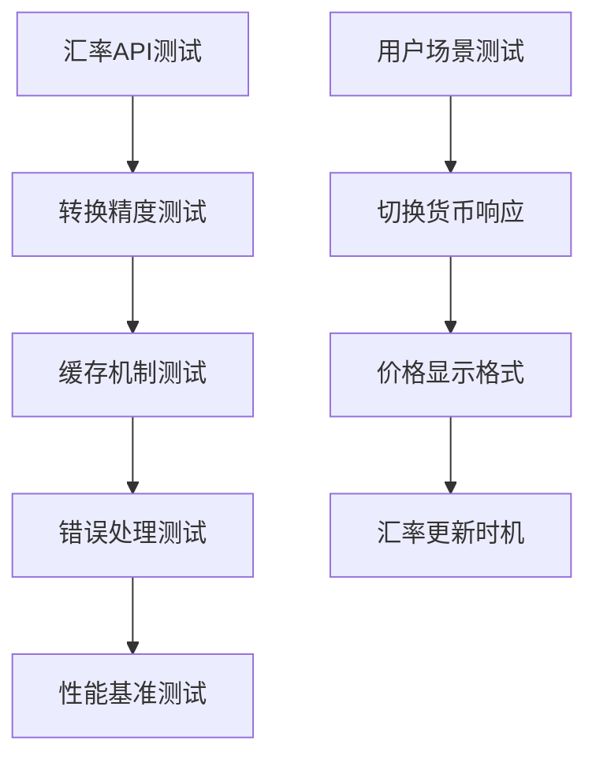

### 2. 性能测试

#### 关键指标
- **首次内容绘制 (FCP)**：< 1.5s
- **最大内容绘制 (LCP)**：< 2.5s
- **累积布局偏移 (CLS)**：< 0.1
- **首次输入延迟 (FID)**：< 100ms

#### 测试场景
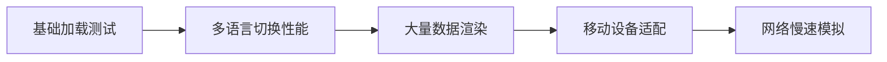

### 3. 用户体验测试

#### A/B 测试计划
- **对照组**：当前详情页面设计
- **实验组**：新优化的详情页面设计
- **测试指标**：
  - 用户停留时间
  - 详情页面打开率
  - 外部链接点击率
  - 用户满意度评分

## 部署与发布

### 1. 分阶段发布计划

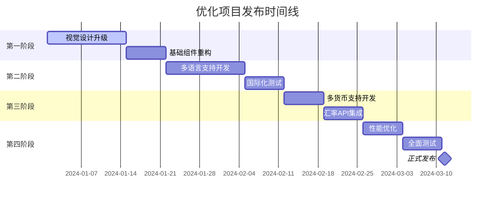

### 2. 发布检查清单

#### 功能完整性
- [ ] 所有新组件正常工作
- [ ] 多语言切换功能正常
- [ ] 多货币转换功能正常
- [ ] 响应式布局适配各设备
- [ ] 性能指标达到要求

#### 内容质量
- [ ] 翻译内容准确性检查
- [ ] 汇率数据实时性验证
- [ ] 视觉设计一致性确认
- [ ] 交互体验流畅性测试

## 维护与优化

### 1. 长期维护计划

#### 内容维护
- **翻译内容更新**：每月检查翻译质量，根据用户反馈优化
- **汇率数据监控**：监控API可用性，确保数据准确性
- **新语言支持**：根据用户需求逐步添加新的语言支持

#### 技术维护
- **依赖包更新**：定期更新国际化和汇率相关依赖包
- **性能监控**：持续监控页面性能，及时优化
- **用户体验改进**：收集用户反馈，持续改进交互体验

### 2. 扩展性考虑

#### 新功能扩展接口
```typescript
interface ExtensionPoints {
  // 新语言支持扩展点
  addLanguageSupport(locale: string, translations: any): void;
  
  // 新货币支持扩展点  
  addCurrencySupport(currency: Currency, config: CurrencyConfig): void;
  
  // 自定义功能展示组件
  registerFeatureComponent(type: string, component: React.ComponentType): void;
  
  // 自定义主题扩展
  registerTheme(name: string, theme: ThemeConfig): void;
}
```

这个设计文档为 Setapp 应用展示平台的详情页面优化提供了全面的技术方案，涵盖了功能重构、多语言支持、多货币转换、视觉升级和性能优化等各个方面，确保项目能够提供更好的用户体验和更专业的产品展示效果。