# 页面卡片响应式优化设计

## 概述

本设计文档针对 Setapp 应用展示平台的全面优化升级，包含五个核心改进方向：

1. **高级配色系统重构**：从高饱和度配色升级为低饱和度、高级感的 Claude 风格配色系统
2. **卡片布局响应式优化**：解决宽屏设备上卡片布局两边空白过多的问题
3. **模态框功能板块重构**：优化应用详情模态框中四个功能板块的内容质量和布局方式
4. **主页面国际化功能**：在主页面添加多语言和多货币一键切换功能
5. **紧凑布局设计**：优化卡片间距和布局密度，提升空间利用效率

通过系统性的视觉升级和功能优化，为用户提供更加精致、高效的浏览体验。

## 技术栈

- **前端框架**: React 18 + TypeScript
- **样式框架**: Tailwind CSS
- **状态管理**: Zustand
- **国际化**: i18next + react-i18next
- **货币系统**: 内置汇率转换 API
- **组件库**: Lucide React (图标)
- **响应式策略**: CSS Grid + Flexbox
- **色彩管理**: CSS 变量 + Tailwind 色彩系统

## 高级配色系统设计

### 当前配色问题分析

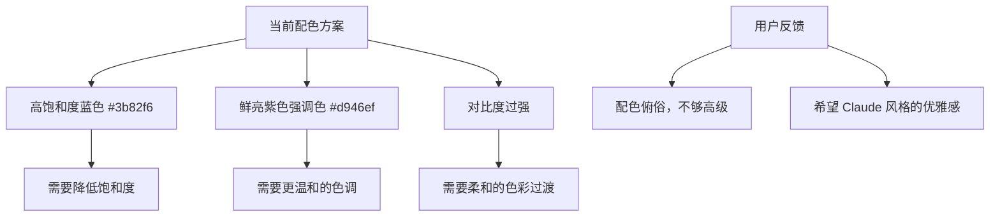

### Claude 风格配色分析

基于 Claude 官网的色彩研究，提取出以下设计特征：

| 色彩类型 | Claude 配色 | 特征描述 | 应用场景 |
|------------|-------------|-----------|----------|
| **主调** | #b05730 - #cd6f47 | 温暖的赤土色系 | CTA 按钮、链接 |
| **背景** | #f0eee5 - #ddd9c5 | 温暖的米白色系 | 页面背景、卡片背景 |
| **强调** | #6c5dac - #8a7fbd | 低饱和度紫色系 | 重要信息、标签 |
| **中性** | #ffffff - #f8f9fa | 纯白到浅灰色 | 文字、分割线 |

### 新配色系统设计

#### 1. 主色调 (Primary) - 温暖赤土色系

```css
primary: {
  50: '#fdf8f6',   // 极浅温暖色
  100: '#f8ece7',  // 浅温暖色  
  200: '#edcdbf',  // 中浅温暖色
  300: '#e2ae97',  // 中温暖色
  400: '#d88e6f',  // 中深温暖色
  500: '#cd6f47',  // 温暖主色
  600: '#b05730',  // 深温暖色
  700: '#884325',  // 较深温暖色
  800: '#602f1a',  // 深褐色
  900: '#381c0f',  // 极深褐色
  950: '#1a0e07'   // 最深褐色
}
```

#### 2. 辅助色 (Secondary) - 柔和灰色系

```css
secondary: {
  50: '#fafafa',   // 极浅灰
  100: '#f4f4f5',  // 浅灰
  200: '#e4e4e7',  // 中浅灰
  300: '#d4d4d8',  // 中灰
  400: '#a1a1aa',  // 中深灰
  500: '#71717a',  // 主灰色
  600: '#52525b',  // 深灰
  700: '#3f3f46',  // 较深灰
  800: '#27272a',  // 深灰
  900: '#18181b',  // 极深灰
  950: '#09090b'   // 最深灰
}
```

#### 3. 强调色 (Accent) - 低饱和度紫色系

```css
accent: {
  50: '#faf9fc',   // 极浅紫
  100: '#f3f1f8',  // 浅紫
  200: '#e6e4f1',  // 中浅紫
  300: '#d1ccdf',  // 中紫
  400: '#b3a9c7',  // 中深紫
  500: '#8a7fbd',  // 主紫色
  600: '#6c5dac',  // 深紫
  700: '#55498d',  // 较深紫
  800: '#41376c',  // 深紫
  900: '#2d264a',  // 极深紫
  950: '#181528'   // 最深紫
}
```

#### 4. 背景色系 (Neutral) - 温暖米色系

```css
neutral: {
  50: '#fefefe',   // 纯白
  100: '#fdfdfc',  // 极浅米色
  200: '#f9f8f4',  // 浅米色
  300: '#f0eee5',  // 中浅米色
  400: '#e8e5d8',  // 中米色
  500: '#ddd9c5',  // 主米色
  600: '#cbc4a4',  // 深米色
  700: '#b8af84',  // 较深米色
  800: '#a69a64',  // 深米色
  900: '#887d4e',  // 极深米色
  950: '#6b6139'   // 最深米色
}
```

## 响应式卡片布局优化

### 当前问题分析

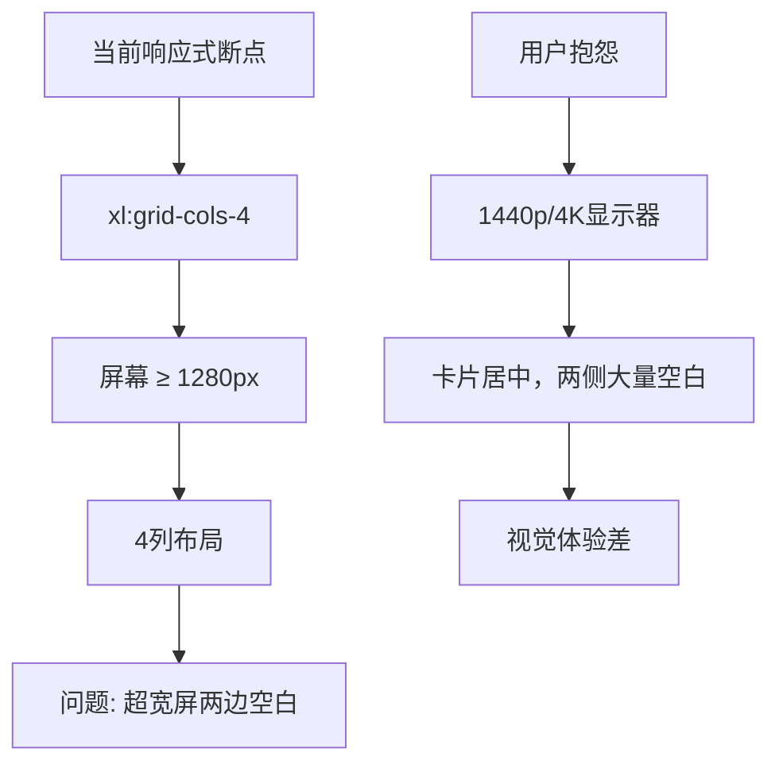

### 优化方案设计

#### 1. 紧凑布局策略

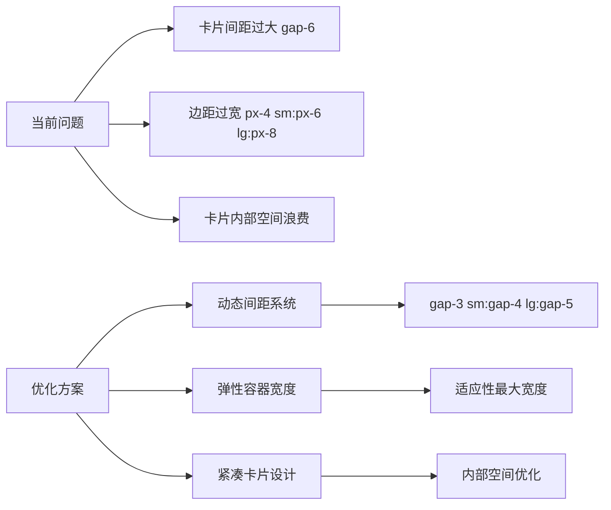

#### 2. 响应式断点扩展策略

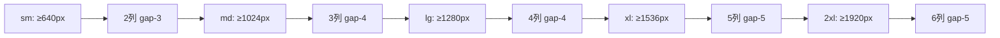

#### 3. 紧凑布局参数表

| 屏幕宽度范围 | 容器最大宽度 | 列数 | 卡片间距 | 边距 | 优化效果 |
|-------------|-------------|------|----------|------|----------|
| 640px - 767px | max-w-3xl | 2列 | gap-3 | px-3 | 手机优化 |
| 768px - 1023px | max-w-5xl | 3列 | gap-4 | px-4 | 平板优化 |
| 1024px - 1279px | max-w-6xl | 4列 | gap-4 | px-6 | 笔记本优化 |
| 1280px - 1535px | max-w-7xl | 5列 | gap-5 | px-6 | 桌面优化 |
| 1536px - 1919px | max-w-8xl | 6列 | gap-5 | px-8 | 大屏优化 |
| ≥1920px | max-w-[110rem] | 7列 | gap-6 | px-8 | 超宽屏优化 |

#### 4. 动态网格系统实现

```typescript
// 紧凑响应式类名映射
const getGridClasses = (viewMode: 'grid' | 'list') => {
  if (viewMode === 'list') return 'space-y-3';
  
  return `grid grid-cols-1 sm:grid-cols-2 md:grid-cols-3 lg:grid-cols-4 
          xl:grid-cols-5 2xl:grid-cols-6 3xl:grid-cols-7 
          gap-3 sm:gap-4 lg:gap-5 2xl:gap-6`;
};

// 紧凑容器类名映射  
const getContainerClasses = () => {
  return `max-w-3xl sm:max-w-5xl md:max-w-6xl lg:max-w-7xl xl:max-w-8xl 
          2xl:max-w-[110rem] mx-auto px-3 sm:px-4 md:px-6 xl:px-8`;
};

// 卡片内部空间优化
const getCardClasses = () => {
  return `bg-neutral-50 hover:bg-white rounded-2xl border border-neutral-200/60 
          hover:border-primary-200/40 shadow-sm hover:shadow-lg 
          transition-all duration-300 p-4 lg:p-5`;
};
```

## 主页面国际化功能设计

### 当前状态分析

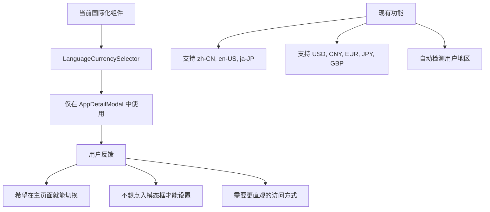

### 主页面国际化功能设计

#### 1. 头部快速切换器

```mermaid
graph LR
    A[页面头部] --> B[快速切换器]
    B --> C[语言选择器]
    B --> D[货币选择器]
    
    C --> E[中文 | English | 日本語]
    D --> F[CNY | USD | EUR | JPY | GBP]
    
    style B fill:#f0eee5,stroke:#cd6f47
    style C fill:#f3f1f8,stroke:#8a7fbd
    style D fill:#f3f1f8,stroke:#8a7fbd
```

#### 2. 快速切换组件设计

```typescript
// 主页面快速切换器组件
interface QuickSwitcherProps {
  position: 'header' | 'floating';
  theme: 'light' | 'dark' | 'gradient';
  compact: boolean;
}

// 布局选项
const layoutModes = {
  header: {
    className: 'flex items-center space-x-3',
    buttonSize: 'sm',
    showLabels: false
  },
  floating: {
    className: 'fixed top-4 right-4 z-40',
    buttonSize: 'md', 
    showLabels: true
  }
};
```

#### 3. 置位方案

| 位置选项 | 优点 | 缺点 | 适用场景 |
|----------|------|------|----------|
| **头部右上角** | 传统位置，用户熟悉 | 占用头部空间 | 桌面端主要使用 |
| **浮动按钮** | 空间独立，始终可见 | 可能遮挡内容 | 移动端主要使用 |
| **搜索栏旁边** | 与搜索功能逻辑相关 | 易被忽略 | 功能区集成 |
| **粘性头部** | 滚动时仍然可用 | 无法隐藏 | 专业工具型应用 |

**推荐方案**：粘性头部 + 响应式设计

## 模态框功能板块重构

### 当前问题分析

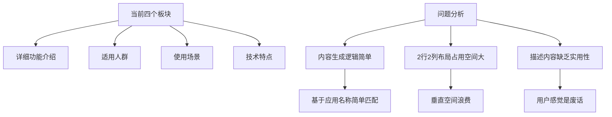

### 重构设计方案

#### 1. 新板块内容策略

| 板块名称 | 重构内容 | 数据来源 | 展示重点 |
|---------|----------|----------|----------|
| **核心功能** | 提取应用真实功能点 | App.功能描述解析 | 主要功能特性 |
| **兼容性** | 系统要求和平台支持 | App.平台 + App.系统要求 | 技术兼容信息 |
| **性能指标** | 评分、大小、更新频率 | App.评分 + App.应用大小 | 关键性能数据 |
| **获取方式** | 价格、链接、订阅模式 | App.官方订阅价格 + 链接 | 获取途径信息 |

#### 2. 一行四列布局设计

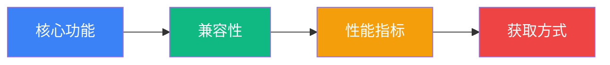

#### 3. 内容生成逻辑重构

```typescript
// 核心功能提取算法
const extractCoreFeatures = (app: App): string[] => {
  const description = app.功能描述;
  
  // 关键词映射表
  const featureKeywords = {
    '截图': ['多格式导出', '编辑标注', '云端同步'],
    '清理': ['垃圾清理', '重复文件', '缓存优化'],
    'PDF': ['文档编辑', '格式转换', 'OCR识别'],
    '思维导图': ['可视化思考', '团队协作', '模板库']
  };
  
  // 基于功能描述智能匹配
  return matchFeaturesByDescription(description, featureKeywords);
};

// 兼容性信息整合
const getCompatibilityInfo = (app: App) => ({
  platform: app.平台,
  requirements: app.系统要求,
  supportedVersions: extractVersionInfo(app.系统要求)
});
```

## 组件架构设计

### 1. Home页面组件更新

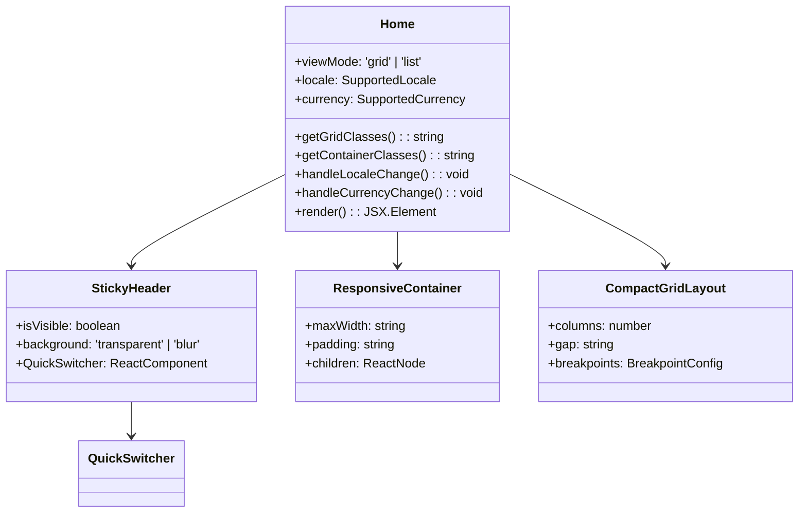

### 2. 快速切换器组件

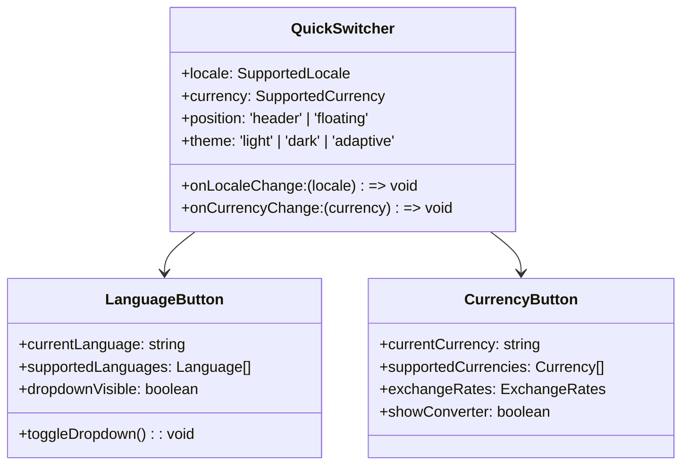

### 3. 重构后的功能板块组件

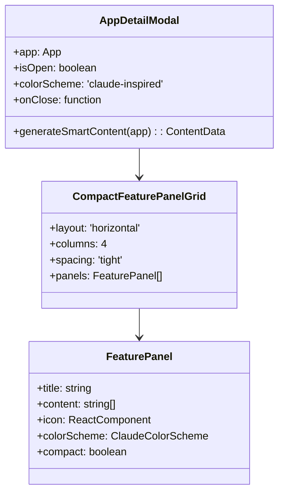

## 实现细节

### 1. Claude 风格 Tailwind 配置

```javascript
// tailwind.config.js 新配色系统
module.exports = {
  theme: {
    extend: {
      colors: {
        // Claude 风格主色调 - 温暖赤土色
        primary: {
          50: '#fdf8f6',
          100: '#f8ece7', 
          200: '#edcdbf',
          300: '#e2ae97',
          400: '#d88e6f',
          500: '#cd6f47',  // 主色
          600: '#b05730',
          700: '#884325',
          800: '#602f1a',
          900: '#381c0f',
          950: '#1a0e07'
        },
        // 低饱和度强调色 - 紫灰色系
        accent: {
          50: '#faf9fc',
          100: '#f3f1f8',
          200: '#e6e4f1', 
          300: '#d1ccdf',
          400: '#b3a9c7',
          500: '#8a7fbd',  // 主强调色
          600: '#6c5dac',
          700: '#55498d',
          800: '#41376c',
          900: '#2d264a',
          950: '#181528'
        },
        // 温暖中性色 - 米色系
        neutral: {
          50: '#fefefe',
          100: '#fdfdfc',
          200: '#f9f8f4',
          300: '#f0eee5',  // Claude 背景色
          400: '#e8e5d8',
          500: '#ddd9c5',
          600: '#cbc4a4',
          700: '#b8af84',
          800: '#a69a64', 
          900: '#887d4e',
          950: '#6b6139'
        },
        // 保留功能性色彩（低饱和度版本）
        success: {
          50: '#f6fdf8',
          500: '#22c55e',
          600: '#16a34a'
        },
        warning: {
          50: '#fffcf5', 
          500: '#f59e0b',
          600: '#d97706'
        },
        danger: {
          50: '#fef7f7',
          500: '#ef4444', 
          600: '#dc2626'
        }
      },
      screens: {
        '3xl': '1920px',  // 超宽屏断点
        '4xl': '2560px'   // 4K显示器断点
      },
      maxWidth: {
        '8xl': '88rem',   // 1408px
        '9xl': '96rem',   // 1536px  
        '10xl': '110rem', // 1760px
        '11xl': '120rem'  // 1920px
      },
      gridTemplateColumns: {
        '5': 'repeat(5, minmax(0, 1fr))',
        '6': 'repeat(6, minmax(0, 1fr))',
        '7': 'repeat(7, minmax(0, 1fr))'
      },
      spacing: {
        '15': '3.75rem',
        '18': '4.5rem'
      }
    }
  }
}
```

### 2. 粘性头部快速切换器实现

```jsx
// 在 Home 组件中添加粘性头部
const StickyQuickSwitcher = () => {
  const { locale, currency, setLocale, setCurrency } = useI18nStore();
  const [isScrolled, setIsScrolled] = useState(false);
  
  // 滚动检测
  useEffect(() => {
    const handleScroll = () => {
      setIsScrolled(window.scrollY > 100);
    };
    window.addEventListener('scroll', handleScroll);
    return () => window.removeEventListener('scroll', handleScroll);
  }, []);
  
  return (
    <div className={`fixed top-0 left-0 right-0 z-50 transition-all duration-300 ${
      isScrolled 
        ? 'bg-neutral-100/80 backdrop-blur-md border-b border-neutral-200/50 shadow-sm' 
        : 'bg-transparent'
    }`}>
      <div className="max-w-10xl mx-auto px-4 sm:px-6 lg:px-8">
        <div className="flex items-center justify-between py-3">
          {/* 左侧空间或Logo */}
          <div className="flex-1" />
          
          {/* 右侧快速切换器 */}
          <div className="flex items-center space-x-3">
            {/* 语言切换 */}
            <div className="relative group">
              <button className="flex items-center space-x-2 px-3 py-2 rounded-xl bg-white/60 hover:bg-white/80 border border-neutral-200/60 hover:border-primary-300/60 transition-all duration-200 shadow-sm hover:shadow-md">
                <Globe className="w-4 h-4 text-neutral-600" />
                <span className="text-sm font-medium text-neutral-700 hidden sm:inline">
                  {getLanguageName(locale)}
                </span>
                <ChevronDown className="w-3 h-3 text-neutral-500" />
              </button>
              
              {/* 下拉菜单 */}
              <div className="absolute right-0 top-full mt-2 w-40 bg-white rounded-xl border border-neutral-200 shadow-lg opacity-0 group-hover:opacity-100 transition-all duration-200 pointer-events-none group-hover:pointer-events-auto">
                {supportedLocales.map((loc) => (
                  <button
                    key={loc}
                    onClick={() => setLocale(loc)}
                    className={`w-full text-left px-4 py-2 text-sm transition-colors first:rounded-t-xl last:rounded-b-xl ${
                      loc === locale 
                        ? 'bg-primary-50 text-primary-700 font-medium' 
                        : 'text-neutral-700 hover:bg-neutral-50'
                    }`}
                  >
                    {getLanguageName(loc)}
                  </button>
                ))}
              </div>
            </div>
            
            {/* 货币切换 */}
            <div className="relative group">
              <button className="flex items-center space-x-2 px-3 py-2 rounded-xl bg-white/60 hover:bg-white/80 border border-neutral-200/60 hover:border-accent-300/60 transition-all duration-200 shadow-sm hover:shadow-md">
                <span className="text-sm font-bold text-neutral-600">
                  {currencyInfoMap[currency].symbol}
                </span>
                <span className="text-sm font-medium text-neutral-700 hidden sm:inline">
                  {currency}
                </span>
                <ChevronDown className="w-3 h-3 text-neutral-500" />
              </button>
              
              {/* 下拉菜单 */}
              <div className="absolute right-0 top-full mt-2 w-32 bg-white rounded-xl border border-neutral-200 shadow-lg opacity-0 group-hover:opacity-100 transition-all duration-200 pointer-events-none group-hover:pointer-events-auto">
                {supportedCurrencies.map((curr) => (
                  <button
                    key={curr}
                    onClick={() => setCurrency(curr)}
                    className={`w-full text-left px-4 py-2 text-sm transition-colors first:rounded-t-xl last:rounded-b-xl ${
                      curr === currency 
                        ? 'bg-accent-50 text-accent-700 font-medium' 
                        : 'text-neutral-700 hover:bg-neutral-50'
                    }`}
                  >
                    <span className="font-bold mr-2">{currencyInfoMap[curr].symbol}</span>
                    {curr}
                  </button>
                ))}
              </div>
            </div>
          </div>
        </div>
      </div>
    </div>
  );
};
```

### 3. 紧凑卡片容器实现

```jsx
// 优化后的紧凑卡片容器组件
const CompactCardContainer = ({ children, viewMode }) => {
  const containerClasses = `
    max-w-3xl sm:max-w-5xl md:max-w-6xl lg:max-w-7xl xl:max-w-8xl 2xl:max-w-[110rem]
    mx-auto px-3 sm:px-4 md:px-6 xl:px-8 py-6
  `;
  
  const gridClasses = viewMode === 'grid' 
    ? `grid grid-cols-1 sm:grid-cols-2 md:grid-cols-3 lg:grid-cols-4 
       xl:grid-cols-5 2xl:grid-cols-6 3xl:grid-cols-7 
       gap-3 sm:gap-4 lg:gap-5 2xl:gap-6`
    : 'space-y-3';
    
  return (
    <div className={containerClasses}>
      <div className={gridClasses}>
        {children}
      </div>
    </div>
  );
};
```

### 4. Claude 风格卡片组件

```jsx
// 重设计的卡片组件
const ClaudeStyleAppCard = ({ app, viewMode }) => {
  const cardClasses = `
    group bg-neutral-50 hover:bg-white rounded-2xl 
    border border-neutral-200/60 hover:border-primary-200/40 
    shadow-sm hover:shadow-lg transition-all duration-300 
    p-4 lg:p-5 cursor-pointer
    hover:scale-[1.02] active:scale-[0.98]
  `;
  
  return (
    <div className={cardClasses} onClick={() => setSelectedApp(app)}>
      {/* 应用图标和名称 */}
      <div className="flex items-start space-x-3 mb-3">
        
        <div className="flex-1 min-w-0">
          <h3 className="font-semibold text-neutral-900 truncate text-sm lg:text-base">
            {app.名称}
          </h3>
          <div className="flex items-center mt-1">
            <div className="flex items-center space-x-1">
              {renderStars(app.评分)}
            </div>
            <span className="text-xs text-neutral-500 ml-2">
              ({app.评分}/100)
            </span>
          </div>
        </div>
      </div>
      
      {/* 功能描述 */}
      <p className="text-sm text-neutral-600 line-clamp-2 mb-3 leading-relaxed">
        {app.功能描述}
      </p>
      
      {/* 底部信息 */}
      <div className="flex items-center justify-between">
        <span className={`text-xs font-medium px-2 py-1 rounded-lg ${
          app.平台 === 'macOS' 
            ? 'bg-primary-100 text-primary-700'
            : 'bg-accent-100 text-accent-700'
        }`}>
          {app.平台}
        </span>
        
        <span className="text-sm font-semibold text-neutral-800">
          {formatPrice(app.官方订阅价格)}
        </span>
      </div>
    </div>
  );
};
```

### 5. 一行四列功能板块重构

```jsx
// 新的一行四列功能板块
const ClaudeStyleFeaturePanels = ({ app }) => {
  const panels = [
    {
      title: '核心功能',
      icon: Zap,
      colorScheme: 'primary',
      content: extractCoreFeatures(app)
    },
    {
      title: '兼容性',
      icon: Monitor, 
      colorScheme: 'accent',
      content: getCompatibilityInfo(app)
    },
    {
      title: '性能指标',
      icon: BarChart3,
      colorScheme: 'neutral', 
      content: getPerformanceMetrics(app)
    },
    {
      title: '获取方式',
      icon: Download,
      colorScheme: 'success',
      content: getAcquisitionInfo(app)
    }
  ];

  return (
    <div className="grid grid-cols-1 sm:grid-cols-2 xl:grid-cols-4 gap-4">
      {panels.map((panel, index) => (
        <ClaudeFeaturePanel key={index} {...panel} />
      ))}
    </div>
  );
};

// 单个功能板块组件
const ClaudeFeaturePanel = ({ title, icon: Icon, colorScheme, content }) => {
  const colorSchemes = {
    primary: {
      bg: 'bg-gradient-to-br from-primary-50 to-primary-100/50',
      border: 'border-primary-200/60',
      icon: 'text-primary-600',
      title: 'text-primary-800',
      text: 'text-primary-700',
      accent: 'bg-primary-500'
    },
    accent: {
      bg: 'bg-gradient-to-br from-accent-50 to-accent-100/50',
      border: 'border-accent-200/60', 
      icon: 'text-accent-600',
      title: 'text-accent-800',
      text: 'text-accent-700',
      accent: 'bg-accent-500'
    },
    neutral: {
      bg: 'bg-gradient-to-br from-neutral-100 to-neutral-200/50',
      border: 'border-neutral-300/60',
      icon: 'text-neutral-600', 
      title: 'text-neutral-800',
      text: 'text-neutral-700',
      accent: 'bg-neutral-500'
    },
    success: {
      bg: 'bg-gradient-to-br from-success-50 to-success-100/50',
      border: 'border-success-200/60',
      icon: 'text-success-600',
      title: 'text-success-800', 
      text: 'text-success-700',
      accent: 'bg-success-500'
    }
  };
  
  const scheme = colorSchemes[colorScheme];
  
  return (
    <div className={`${scheme.bg} ${scheme.border} border rounded-2xl p-4 transition-all duration-200 hover:shadow-md`}>
      {/* 标题区域 */}
      <div className="flex items-center space-x-3 mb-3">
        <div className={`${scheme.accent} rounded-lg p-2`}>
          <Icon className={`w-4 h-4 text-white`} />
        </div>
        <h3 className={`font-semibold text-sm ${scheme.title}`}>
          {title}
        </h3>
      </div>
      
      {/* 内容区域 */}
      <div className="space-y-2">
        {content.slice(0, 3).map((item, idx) => (
          <div key={idx} className="flex items-start space-x-2">
            <div className={`w-1.5 h-1.5 rounded-full ${scheme.accent} mt-1.5 flex-shrink-0`} />
            <span className={`text-xs ${scheme.text} leading-relaxed`}>
              {item}
            </span>
          </div>
        ))}
      </div>
    </div>
  );
};
``` 
      color: 'green',
      content: getCompatibilityInfo(app)
    },
    {
      title: '性能指标',
      icon: '📊',
      color: 'orange', 
      content: getPerformanceMetrics(app)
    },
    {
      title: '获取方式',
      icon: '🔗',
      color: 'red',
      content: getAcquisitionInfo(app)
    }
  ];

  return (
    <div className="grid grid-cols-1 md:grid-cols-2 xl:grid-cols-4 gap-6">
      {panels.map((panel, index) => (
        <FeaturePanel key={index} {...panel} />
      ))}
    </div>
  );
};
```

## 用户体验改进

### 高级感配色体验提升

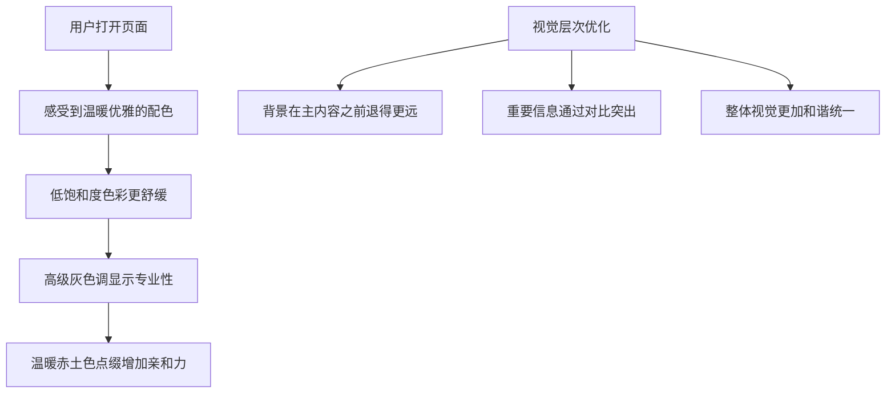

### 国际化体验优化

| 体验指标 | 优化前 | 优化后 |
|----------|----------|----------|
| **访问方式** | 必须点击卡片进入模态框 | 主页面右上角直接切换 |
| **可发现性** | 隐藏在模态框中，难以发现 | 粘性头部，始终可见 |
| **操作效率** | 3-4次点击才能切换 | 1次点击即可切换 |
| **视觉设计** | 与模态框风格统一 | 与新配色系统和谐 |
| **响应式表现** | 仅桌面端友好 | 移动端也可用 |

### 紧凑布局体验提升

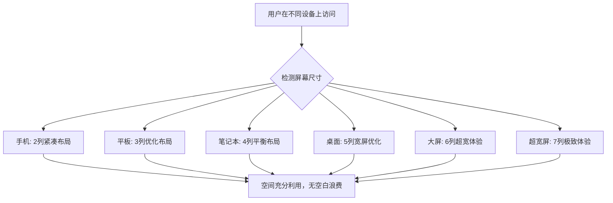

### 功能板块优化对比

| 指标 | 优化前 | 优化后 |
|------|----------|----------|
| **布局方式** | 2行2列垂直布局 | 1行4列水平布局 |
| **内容质量** | 通用化描述内容 | 基于应用实际功能的精准描述 |
| **信息密度** | 占用空间大，信息量少 | 信息密度高，空间利用率好 |
| **视觉设计** | 高饱和度颜色方案 | Claude 风格低饱和度配色 |
| **响应式** | 缺乏移动端优化 | 全设备适配的响应式设计 |

## 性能优化

### 1. CSS 渲染性能

- **化简源码**: 去除未使用的 Tailwind 类，减小 CSS 文件体积
- **CSS 变量优化**: 使用 CSS 自定义属性实现主题切换
- **清理冗余样式**: 移除旧配色系统的相关样式

### 2. 组件渲染优化

```typescript
// 优化国际化组件渲染
const QuickSwitcher = memo(({ locale, currency, onLocaleChange, onCurrencyChange }) => {
  // 缓存计算结果
  const languageName = useMemo(() => getLanguageName(locale), [locale]);
  const currencySymbol = useMemo(() => currencyInfoMap[currency].symbol, [currency]);
  
  return (
    // JSX 内容
  );
});

// 虚拟化卡片列表（在应用数量过多时）
const VirtualizedCardGrid = ({ apps, viewMode }) => {
  const { height, width } = useWindowSize();
  const itemsPerRow = getItemsPerRow(width);
  const itemHeight = viewMode === 'grid' ? 280 : 120;
  
  return (
    <FixedSizeGrid
      columnCount={itemsPerRow}
      columnWidth={width / itemsPerRow}
      height={height - 200}
      rowCount={Math.ceil(apps.length / itemsPerRow)}
      rowHeight={itemHeight}
      itemData={apps}
    >
      {CardItem}
    </FixedSizeGrid>
  );
};
```

### 3. 图片加载优化

```typescript
// 懒加载和 WebP 支持
const OptimizedAppIcon = ({ appName, className }) => {
  const [imageSrc, setImageSrc] = useState(null);
  const [isLoading, setIsLoading] = useState(true);
  const imgRef = useRef(null);
  
  // Intersection Observer 懒加载
  useEffect(() => {
    const observer = new IntersectionObserver(
      ([entry]) => {
        if (entry.isIntersecting) {
          const webpSrc = getAppIcon(appName, 'webp');
          const pngSrc = getAppIcon(appName, 'png');
          
          // 检测 WebP 支持
          const img = new Image();
          img.onload = () => setImageSrc(webpSrc);
          img.onerror = () => setImageSrc(pngSrc);
          img.src = webpSrc;
          
          setIsLoading(false);
          observer.disconnect();
        }
      },
      { threshold: 0.1 }
    );
    
    if (imgRef.current) {
      observer.observe(imgRef.current);
    }
    
    return () => observer.disconnect();
  }, [appName]);
  
  return (
    <div ref={imgRef} className={className}>
      {isLoading ? (
        <div className="bg-neutral-200 animate-pulse rounded-xl" />
      ) : (
        
      )}
    </div>
  );
};
```

## 测试策略

### 1. 响应式测试

```typescript
// 响应式断点测试用例
const breakpointTests = [
  { width: 640, expectedCols: 2, name: 'Tablet Portrait' },
  { width: 1024, expectedCols: 3, name: 'Laptop' },
  { width: 1280, expectedCols: 4, name: 'Desktop' },
  { width: 1536, expectedCols: 5, name: 'Large Desktop' },
  { width: 1920, expectedCols: 6, name: 'Ultra Wide' }
];
```

### 2. 内容质量测试

```typescript
// 功能板块内容测试
const contentQualityTests = [
  {
    app: mockCleanerApp,
    expectedFeatures: ['垃圾清理', '重复文件', '缓存优化'],
    testName: '清理工具功能提取'
  },
  {
    app: mockScreenshotApp, 
    expectedFeatures: ['多格式导出', '编辑标注', '云端同步'],
    testName: '截图工具功能提取'
  }
];
```

## 性能优化

### 1. 渲染性能

- **虚拟滚动**: 在超多卡片时使用虚拟滚动减少DOM节点
- **图片懒加载**: AppCard图标使用Intersection Observer延迟加载
- **CSS Grid优化**: 使用CSS Grid原生性能替代Flexbox嵌套

### 2. 内容生成缓存

```typescript
// 功能描述缓存机制
const featureCache = new Map<string, ProcessedFeatures>();

const getProcessedFeatures = (app: App): ProcessedFeatures => {
  const cacheKey = `${app.名称}-${app.功能描述.slice(0, 50)}`;
  
  if (featureCache.has(cacheKey)) {
    return featureCache.get(cacheKey)!;
  }
  
  const processed = processAppFeatures(app);
  featureCache.set(cacheKey, processed);
  return processed;
};
```

## 实施优先级

### 第一阶段：Claude 风格配色系统升级
1. 更新 Tailwind 配色配置，替换为 Claude 风格配色
2. 更新 index.css 中的 CSS 变量和组件样式
3. 逐步替换组件中的颜色类名
4. 测试整体视觉效果和对比度

### 第二阶段：主页面国际化功能添加
1. 在 Home 组件中添加粘性头部快速切换器
2. 集成现有的 LanguageCurrencySelector 组件
3. 优化移动端响应式表现
4. 测试多语言和多货币切换功能

### 第三阶段：紧凑响应式布局优化  
1. 扩展 Tailwind 断点配置，支持更多屏幕尺寸
2. 更新 Home 页面容器和网格类名
3. 优化卡片间距和内部空间
4. 测试各种屏幕尺寸下的效果

### 第四阶段：模态框功能板块重构
1. 重构 AppDetailModal 四个功能板块
2. 实现一行四列布局
3. 优化内容生成逻辑，提高内容质量
4. 应用 Claude 风格配色到功能板块

### 第五阶段：性能优化和细节打磨
1. 添加虚拟滚动支持（如有需要）
2. 实现内容缓存机制
3. 图片懒加载优化
4. 性能测试和细节调优

## 成功指标

### 视觉设计指标
- **色彩和谐性**: 新配色系统达到 Claude 的优雅感和专业性
- **辞残的这个性**: 页面在各种设备上都能完美显示，无空白浪费
- **信息密度**: 相同空间内展示更多应用卡片

### 功能性能指标  
- **国际化可用性**: 用户可在主页面直接切换语言和货币
- **信息质量**: 模态框功能板块内容更加精准和实用
- **布局效率**: 一行四列布局提高空间利用率

### 用户体验指标
- **访问效率**: 国际化功能访问步骤从 3-4 次点击减少至 1 次
- **视觉舒适度**: 低饱和度配色减少视觉疲劳
- **内容可理解性**: 功能板块内容更加清晰和有用

通过这五个维度的全面优化，Setapp 应用展示平台将获得更加现代化、专业化和用户友好的整体体验。