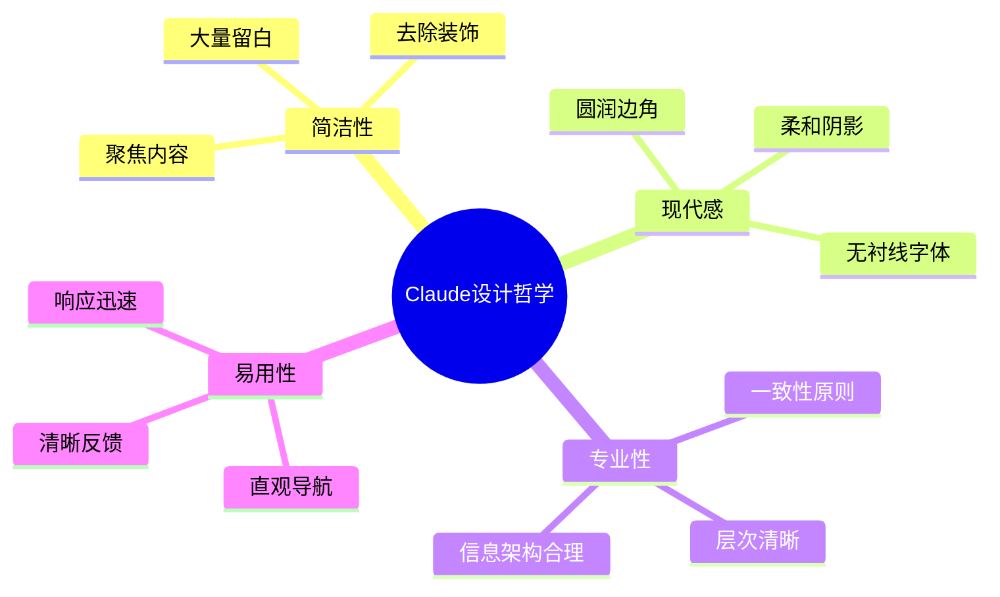
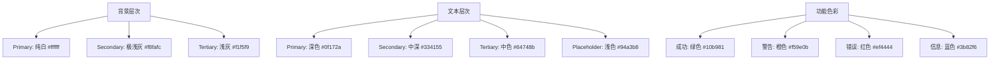
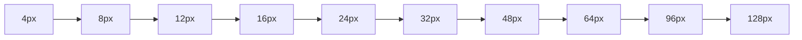
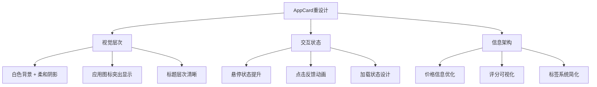
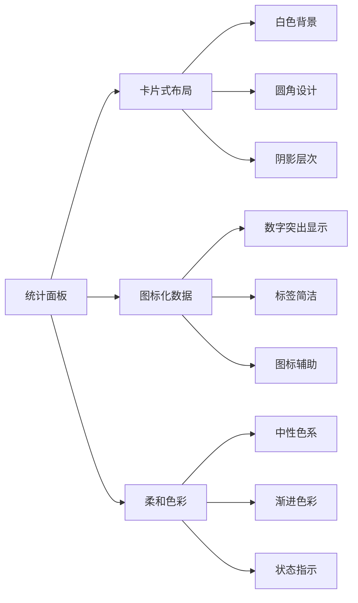
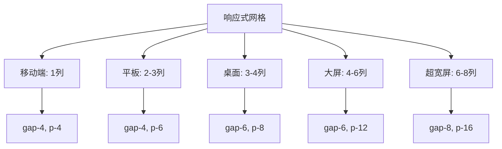
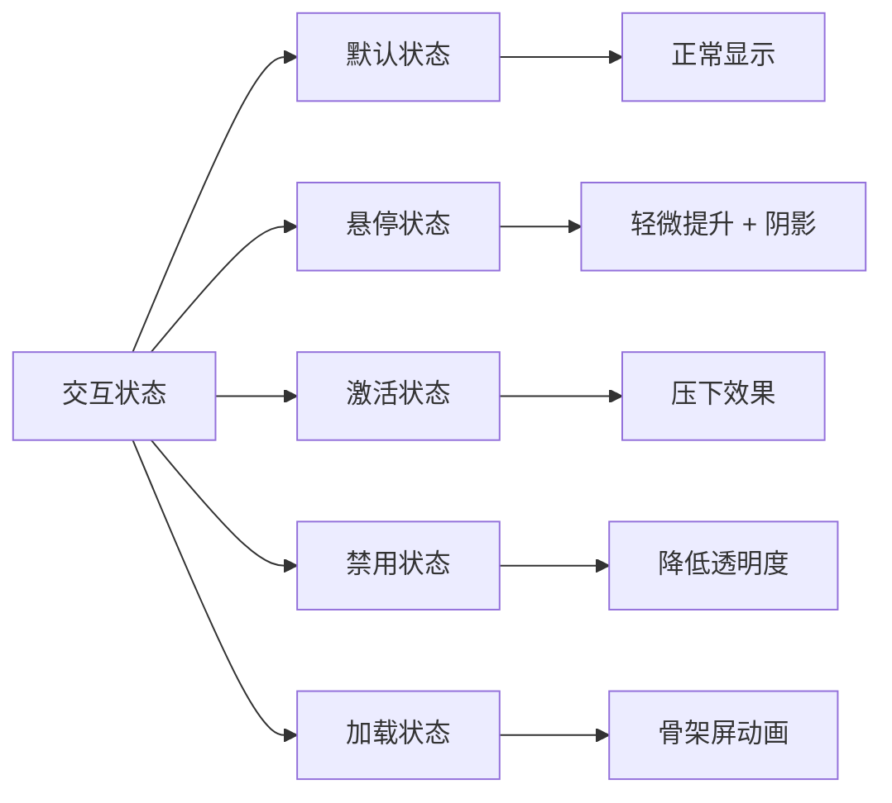
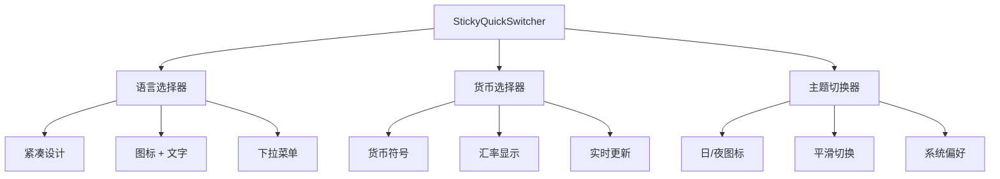
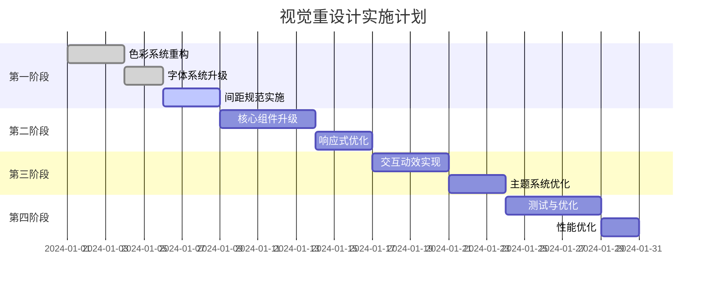

# Setapp Apps Showcase - Claude风格视觉重设计方案

## Overview

基于 Anthropic Claude 官网的现代简洁设计风格，对 Setapp Apps Showcase 应用进行全面的视觉重设计。保持现有功能架构不变的前提下，提升视觉体验、现代感和专业度，创造更加优雅和高效的用户界面。

## 设计理念与原则

### 核心设计哲学
参考 Claude 网站的设计理念，采用"简约而不简单"的设计哲学：



### 设计原则

| 原则 | Claude网站特征 | 应用到项目 |
|------|----------------|------------|
| **极简主义** | 纯净白色背景，最少视觉元素 | 简化卡片设计，减少装饰性元素 |
| **内容优先** | 文字内容清晰可读，信息层次分明 | 突出应用信息，优化阅读体验 |
| **现代字体** | 无衬线字体，多层次字重 | 采用Inter/System字体族 |
| **柔和交互** | 微妙的悬停效果和过渡动画 | 添加平滑过渡和状态反馈 |
| **智能布局** | 自适应间距，响应式设计 | 优化移动端和宽屏体验 |

## 视觉系统重构

### 色彩系统

#### 主色调重新定义
```css
/* Claude风格配色方案 */
:root {
  /* 主色调 - 基于Claude网站的中性色系 */
  --primary-50: #f8fafc;
  --primary-100: #f1f5f9;
  --primary-200: #e2e8f0;
  --primary-300: #cbd5e1;
  --primary-400: #94a3b8;
  --primary-500: #64748b;   /* 主色 */
  --primary-600: #475569;
  --primary-700: #334155;
  --primary-800: #1e293b;
  --primary-900: #0f172a;

  /* 功能色 - 柔和版本 */
  --success: #10b981;
  --warning: #f59e0b;
  --error: #ef4444;
  --info: #3b82f6;

  /* 背景系统 */
  --bg-primary: #ffffff;
  --bg-secondary: #f8fafc;
  --bg-tertiary: #f1f5f9;
  
  /* 边框和分割线 */
  --border-light: #e2e8f0;
  --border-medium: #cbd5e1;
  --border-strong: #94a3b8;
}
```

#### 色彩使用规则


### 字体排版系统

#### 字体族定义
```css
.font-primary {
  font-family: 
    'Inter', 
    -apple-system, 
    BlinkMacSystemFont, 
    'Segoe UI', 
    'Roboto', 
    'Helvetica Neue', 
    Arial, 
    sans-serif;
}

.font-mono {
  font-family: 
    'JetBrains Mono', 
    'Fira Code', 
    'Consolas', 
    'Monaco', 
    monospace;
}
```

#### 排版层次规范

| 层级 | 用途 | 字号 | 字重 | 行高 | Tailwind类名 |
|------|------|------|------|------|---------------|
| H1 | 主标题 | 48px | 700 | 1.2 | `text-5xl font-bold leading-tight` |
| H2 | 页面标题 | 36px | 600 | 1.25 | `text-3xl font-semibold leading-tight` |
| H3 | 区块标题 | 24px | 600 | 1.3 | `text-2xl font-semibold leading-snug` |
| H4 | 卡片标题 | 18px | 500 | 1.4 | `text-lg font-medium leading-relaxed` |
| Body Large | 重要正文 | 16px | 400 | 1.6 | `text-base font-normal leading-relaxed` |
| Body | 标准正文 | 14px | 400 | 1.5 | `text-sm font-normal leading-normal` |
| Caption | 辅助信息 | 12px | 400 | 1.4 | `text-xs font-normal leading-snug` |

### 间距与布局系统

#### 空间系统


#### 组件间距规范

| 场景 | 间距值 | Tailwind类名 | 说明 |
|------|--------|---------------|------|
| 组件内部元素 | 8px | `space-y-2` | 紧密相关元素 |
| 相关组件组 | 16px | `space-y-4` | 功能相关组件 |
| 页面区块 | 32px | `space-y-8` | 主要内容区块 |
| 页面章节 | 64px | `space-y-16` | 页面大章节 |
| 页面边距 | 24px | `px-6 py-6` | 移动端边距 |
| 桌面端边距 | 48px | `lg:px-12 lg:py-12` | 桌面端边距 |

### 阴影和圆角系统

#### 阴影层次
```css
/* Claude风格阴影系统 */
.shadow-soft {
  box-shadow: 
    0 1px 3px 0 rgb(0 0 0 / 0.05),
    0 1px 2px -1px rgb(0 0 0 / 0.05);
}

.shadow-medium {
  box-shadow: 
    0 4px 6px -1px rgb(0 0 0 / 0.05),
    0 2px 4px -2px rgb(0 0 0 / 0.05);
}

.shadow-strong {
  box-shadow: 
    0 10px 15px -3px rgb(0 0 0 / 0.05),
    0 4px 6px -4px rgb(0 0 0 / 0.05);
}

.shadow-interactive {
  box-shadow: 
    0 20px 25px -5px rgb(0 0 0 / 0.08),
    0 8px 10px -6px rgb(0 0 0 / 0.08);
}
```

#### 圆角规范

| 元素类型 | 圆角值 | Tailwind类名 | 使用场景 |
|----------|--------|---------------|----------|
| 按钮 | 8px | `rounded-lg` | 所有按钮元素 |
| 卡片 | 12px | `rounded-xl` | AppCard等卡片组件 |
| 模态框 | 16px | `rounded-2xl` | 弹窗和大型容器 |
| 输入框 | 8px | `rounded-lg` | 搜索框等表单元素 |
| 图标容器 | 6px | `rounded-md` | 小型图标背景 |
| 头像 | 50% | `rounded-full` | 圆形头像和图标 |

## 组件视觉升级方案

### AppCard 组件重设计

#### 设计要求


#### 具体实现规范
```typescript
// AppCard 视觉规范
const cardStyles = {
  container: "bg-white rounded-xl shadow-soft hover:shadow-medium transition-all duration-200 border border-slate-100 overflow-hidden group",
  header: "p-6 pb-4",
  iconContainer: "w-16 h-16 rounded-xl bg-gradient-to-br from-slate-50 to-slate-100 flex items-center justify-center mb-4",
  title: "text-lg font-semibold text-slate-900 line-clamp-1 mb-1",
  description: "text-sm text-slate-600 line-clamp-2 leading-relaxed",
  footer: "px-6 py-4 bg-slate-50 border-t border-slate-100",
  priceContainer: "flex items-center justify-between",
  price: "text-base font-medium text-slate-900",
  rating: "flex items-center space-x-1 text-sm text-slate-500"
}
```

### SearchFilters 组件升级

#### 设计重点
- **简化视觉噪音**：移除不必要的边框和背景色
- **现代化输入框**：采用 Claude 风格的搜索框设计
- **智能筛选器**：视觉上更加直观和易用

#### 视觉规范
```typescript
const searchFilterStyles = {
  container: "bg-white rounded-2xl shadow-soft border border-slate-200 p-6 mb-8",
  searchInput: "w-full px-4 py-3 text-base border border-slate-200 rounded-lg focus:ring-2 focus:ring-blue-500 focus:border-transparent transition-all",
  filterGroup: "grid grid-cols-2 md:grid-cols-4 gap-4 mt-6",
  filterButton: "px-4 py-2 text-sm font-medium rounded-lg border border-slate-200 bg-white hover:bg-slate-50 active:bg-slate-100 transition-colors",
  filterButtonActive: "px-4 py-2 text-sm font-medium rounded-lg bg-blue-50 border-blue-200 text-blue-700"
}
```

### StatsPanel 组件重构

#### 数据可视化优化


#### 实现规范
```typescript
const statsPanelStyles = {
  container: "grid grid-cols-2 lg:grid-cols-4 gap-4 mb-8",
  statCard: "bg-white rounded-xl shadow-soft border border-slate-100 p-6 text-center group hover:shadow-medium transition-all duration-200",
  statNumber: "text-2xl font-bold text-slate-900 mb-1",
  statLabel: "text-sm font-medium text-slate-600",
  statIcon: "w-8 h-8 mx-auto mb-3 text-slate-400 group-hover:text-slate-600 transition-colors"
}
```

### AppDetailModal 模态框升级

#### 设计重点
- **大尺寸模态框**：提供更好的内容展示空间
- **分层信息架构**：清晰的信息组织和视觉层次
- **现代化关闭交互**：Claude风格的关闭按钮和蒙层

#### 视觉规范
```typescript
const modalStyles = {
  overlay: "fixed inset-0 bg-black bg-opacity-25 backdrop-blur-sm z-50 flex items-center justify-center p-4",
  container: "bg-white rounded-2xl shadow-interactive max-w-4xl w-full max-h-[90vh] overflow-y-auto",
  header: "p-8 pb-6 border-b border-slate-100",
  closeButton: "absolute top-6 right-6 p-2 rounded-lg hover:bg-slate-100 transition-colors",
  content: "p-8 pt-6",
  footer: "p-8 pt-0 border-t border-slate-100 bg-slate-50"
}
```

## 布局与响应式优化

### 页面网格系统

#### 响应式断点
```css
/* 基于Claude网站的响应式设计 */
@media (min-width: 640px)  { /* sm */ }
@media (min-width: 768px)  { /* md */ }
@media (min-width: 1024px) { /* lg */ }
@media (min-width: 1280px) { /* xl */ }
@media (min-width: 1536px) { /* 2xl */ }
@media (min-width: 1920px) { /* 3xl - 扩展断点 */ }
@media (min-width: 2560px) { /* 4xl - 扩展断点 */ }
```

#### 网格布局规范


### 容器系统
```typescript
const containerStyles = {
  page: "min-h-screen bg-slate-50",
  main: "container mx-auto px-4 sm:px-6 lg:px-8 xl:px-12 2xl:px-16 3xl:px-24 py-8 lg:py-12",
  section: "mb-12 lg:mb-16",
  cardGrid: "grid grid-cols-1 sm:grid-cols-2 lg:grid-cols-3 xl:grid-cols-4 2xl:grid-cols-5 3xl:grid-cols-6 4xl:grid-cols-8 gap-4 lg:gap-6"
}
```

## 交互与动效设计

### 微交互系统

#### 悬停效果
```css
/* Claude风格悬停效果 */
.hover-lift {
  transition: transform 200ms ease, box-shadow 200ms ease;
}

.hover-lift:hover {
  transform: translateY(-2px);
  box-shadow: 
    0 10px 15px -3px rgb(0 0 0 / 0.08),
    0 4px 6px -4px rgb(0 0 0 / 0.08);
}

.hover-scale {
  transition: transform 200ms ease;
}

.hover-scale:hover {
  transform: scale(1.02);
}
```

#### 状态反馈


### 过渡动画规范

#### 动画时长和缓动
```css
/* 动画规范 */
.transition-fast {
  transition-duration: 150ms;
  transition-timing-function: cubic-bezier(0.4, 0, 0.2, 1);
}

.transition-normal {
  transition-duration: 200ms;
  transition-timing-function: cubic-bezier(0.4, 0, 0.2, 1);
}

.transition-slow {
  transition-duration: 300ms;
  transition-timing-function: cubic-bezier(0.4, 0, 0.2, 1);
}
```

#### 加载状态设计
```typescript
const loadingStyles = {
  skeleton: "animate-pulse bg-slate-200 rounded",
  spinner: "animate-spin w-5 h-5 border-2 border-slate-300 border-t-slate-600 rounded-full",
  shimmer: "bg-gradient-to-r from-slate-200 via-slate-100 to-slate-200 bg-[length:200%_100%] animate-[shimmer_2s_infinite]"
}
```

## 主题切换优化

### 深色模式适配
基于Claude网站的深色模式设计原则：

```css
/* 深色模式配色 */
@media (prefers-color-scheme: dark) {
  :root {
    --bg-primary: #0f172a;
    --bg-secondary: #1e293b;
    --bg-tertiary: #334155;
    
    --text-primary: #f8fafc;
    --text-secondary: #cbd5e1;
    --text-tertiary: #94a3b8;
    
    --border-light: #334155;
    --border-medium: #475569;
    --border-strong: #64748b;
  }
}

.dark {
  --bg-primary: #0f172a;
  --bg-secondary: #1e293b;
  --bg-tertiary: #334155;
  /* ... 其他深色模式变量 */
}
```

### 主题切换交互
```typescript
const themeToggleStyles = {
  button: "p-2 rounded-lg border border-slate-200 dark:border-slate-700 bg-white dark:bg-slate-800 hover:bg-slate-50 dark:hover:bg-slate-700 transition-colors",
  icon: "w-5 h-5 text-slate-600 dark:text-slate-400"
}
```

## 多语言界面优化

### 语言切换器设计
参考Claude网站的简洁语言选择器：



### 文本适配优化
```typescript
const i18nStyles = {
  languageSelector: "flex items-center space-x-2 px-3 py-2 text-sm font-medium rounded-lg border border-slate-200 bg-white hover:bg-slate-50 transition-colors",
  currencyDisplay: "inline-flex items-center px-2 py-1 text-xs font-medium bg-slate-100 text-slate-700 rounded-md",
  rtlSupport: "rtl:text-right rtl:space-x-reverse"
}
```

## 实施路径与优先级

### 第一阶段：基础视觉系统 (Week 1-2)


### 实施优先级
1. **Critical (P0)**: 色彩系统、字体系统、基础组件样式
2. **High (P1)**: AppCard、SearchFilters、StatsPanel 组件升级
3. **Medium (P2)**: 交互动效、深色模式、响应式优化
4. **Low (P3)**: 高级动画、性能优化、细节打磨

### 技术实现要点
```typescript
// Tailwind配置更新
module.exports = {
  theme: {
    extend: {
      fontFamily: {
        'sans': ['Inter', 'system-ui', 'sans-serif'],
      },
      colors: {
        primary: {
          50: '#f8fafc',
          // ... Claude风格色彩系统
        }
      },
      boxShadow: {
        'soft': '0 1px 3px 0 rgb(0 0 0 / 0.05), 0 1px 2px -1px rgb(0 0 0 / 0.05)',
        // ... Claude风格阴影系统
      }
    }
  }
}
```

### 质量保证
- **设计一致性检查**：确保所有组件遵循统一的视觉规范
- **响应式测试**：在各种设备尺寸下测试布局效果  
- **性能监控**：确保视觉升级不影响加载性能
- **可访问性验证**：保证色彩对比度和交互可访问性
- **跨浏览器兼容性**：测试现代浏览器兼容性      大量留白
      去除装饰
      聚焦内容
    现代感
      无衬线字体
      圆润边角
      柔和阴影
    专业性
      一致性原则
      层次清晰
      信息架构合理
    易用性
      直观导航
      清晰反馈
      响应迅速
```

### 设计原则

| 原则 | Claude网站特征 | 应用到项目 |
|------|----------------|------------|
| **极简主义** | 纯净白色背景，最少视觉元素 | 简化卡片设计，减少装饰性元素 |
| **内容优先** | 文字内容清晰可读，信息层次分明 | 突出应用信息，优化阅读体验 |
| **现代字体** | 无衬线字体，多层次字重 | 采用Inter/System字体族 |
| **柔和交互** | 微妙的悬停效果和过渡动画 | 添加平滑过渡和状态反馈 |
| **智能布局** | 自适应间距，响应式设计 | 优化移动端和宽屏体验 |

## 视觉系统重构

### 色彩系统

#### 主色调重新定义
```css
/* Claude风格配色方案 */
:root {
  /* 主色调 - 基于Claude网站的中性色系 */
  --primary-50: #f8fafc;
  --primary-100: #f1f5f9;
  --primary-200: #e2e8f0;
  --primary-300: #cbd5e1;
  --primary-400: #94a3b8;
  --primary-500: #64748b;   /* 主色 */
  --primary-600: #475569;
  --primary-700: #334155;
  --primary-800: #1e293b;
  --primary-900: #0f172a;

  /* 功能色 - 柔和版本 */
  --success: #10b981;
  --warning: #f59e0b;
  --error: #ef4444;
  --info: #3b82f6;

  /* 背景系统 */
  --bg-primary: #ffffff;
  --bg-secondary: #f8fafc;
  --bg-tertiary: #f1f5f9;
  
  /* 边框和分割线 */
  --border-light: #e2e8f0;
  --border-medium: #cbd5e1;
  --border-strong: #94a3b8;
}
```

#### 色彩使用规则


### 字体排版系统

#### 字体族定义
```css
.font-primary {
  font-family: 
    'Inter', 
    -apple-system, 
    BlinkMacSystemFont, 
    'Segoe UI', 
    'Roboto', 
    'Helvetica Neue', 
    Arial, 
    sans-serif;
}

.font-mono {
  font-family: 
    'JetBrains Mono', 
    'Fira Code', 
    'Consolas', 
    'Monaco', 
    monospace;
}
```

#### 排版层次规范

| 层级 | 用途 | 字号 | 字重 | 行高 | Tailwind类名 |
|------|------|------|------|------|---------------|
| H1 | 主标题 | 48px | 700 | 1.2 | `text-5xl font-bold leading-tight` |
| H2 | 页面标题 | 36px | 600 | 1.25 | `text-3xl font-semibold leading-tight` |
| H3 | 区块标题 | 24px | 600 | 1.3 | `text-2xl font-semibold leading-snug` |
| H4 | 卡片标题 | 18px | 500 | 1.4 | `text-lg font-medium leading-relaxed` |
| Body Large | 重要正文 | 16px | 400 | 1.6 | `text-base font-normal leading-relaxed` |
| Body | 标准正文 | 14px | 400 | 1.5 | `text-sm font-normal leading-normal` |
| Caption | 辅助信息 | 12px | 400 | 1.4 | `text-xs font-normal leading-snug` |

### 间距与布局系统

#### 空间系统


#### 组件间距规范

| 场景 | 间距值 | Tailwind类名 | 说明 |
|------|--------|---------------|------|
| 组件内部元素 | 8px | `space-y-2` | 紧密相关元素 |
| 相关组件组 | 16px | `space-y-4` | 功能相关组件 |
| 页面区块 | 32px | `space-y-8` | 主要内容区块 |
| 页面章节 | 64px | `space-y-16` | 页面大章节 |
| 页面边距 | 24px | `px-6 py-6` | 移动端边距 |
| 桌面端边距 | 48px | `lg:px-12 lg:py-12` | 桌面端边距 |

### 阴影和圆角系统

#### 阴影层次
```css
/* Claude风格阴影系统 */
.shadow-soft {
  box-shadow: 
    0 1px 3px 0 rgb(0 0 0 / 0.05),
    0 1px 2px -1px rgb(0 0 0 / 0.05);
}

.shadow-medium {
  box-shadow: 
    0 4px 6px -1px rgb(0 0 0 / 0.05),
    0 2px 4px -2px rgb(0 0 0 / 0.05);
}

.shadow-strong {
  box-shadow: 
    0 10px 15px -3px rgb(0 0 0 / 0.05),
    0 4px 6px -4px rgb(0 0 0 / 0.05);
}

.shadow-interactive {
  box-shadow: 
    0 20px 25px -5px rgb(0 0 0 / 0.08),
    0 8px 10px -6px rgb(0 0 0 / 0.08);
}
```

#### 圆角规范

| 元素类型 | 圆角值 | Tailwind类名 | 使用场景 |
|----------|--------|---------------|----------|
| 按钮 | 8px | `rounded-lg` | 所有按钮元素 |
| 卡片 | 12px | `rounded-xl` | AppCard等卡片组件 |
| 模态框 | 16px | `rounded-2xl` | 弹窗和大型容器 |
| 输入框 | 8px | `rounded-lg` | 搜索框等表单元素 |
| 图标容器 | 6px | `rounded-md` | 小型图标背景 |
| 头像 | 50% | `rounded-full` | 圆形头像和图标 |

## 组件视觉升级方案

### AppCard 组件重设计

#### 设计要求


#### 具体实现规范
```typescript
// AppCard 视觉规范
const cardStyles = {
  container: "bg-white rounded-xl shadow-soft hover:shadow-medium transition-all duration-200 border border-slate-100 overflow-hidden group",
  header: "p-6 pb-4",
  iconContainer: "w-16 h-16 rounded-xl bg-gradient-to-br from-slate-50 to-slate-100 flex items-center justify-center mb-4",
  title: "text-lg font-semibold text-slate-900 line-clamp-1 mb-1",
  description: "text-sm text-slate-600 line-clamp-2 leading-relaxed",
  footer: "px-6 py-4 bg-slate-50 border-t border-slate-100",
  priceContainer: "flex items-center justify-between",
  price: "text-base font-medium text-slate-900",
  rating: "flex items-center space-x-1 text-sm text-slate-500"
}
```

### SearchFilters 组件升级

#### 设计重点
- **简化视觉噪音**：移除不必要的边框和背景色
- **现代化输入框**：采用 Claude 风格的搜索框设计
- **智能筛选器**：视觉上更加直观和易用

#### 视觉规范
```typescript
const searchFilterStyles = {
  container: "bg-white rounded-2xl shadow-soft border border-slate-200 p-6 mb-8",
  searchInput: "w-full px-4 py-3 text-base border border-slate-200 rounded-lg focus:ring-2 focus:ring-blue-500 focus:border-transparent transition-all",
  filterGroup: "grid grid-cols-2 md:grid-cols-4 gap-4 mt-6",
  filterButton: "px-4 py-2 text-sm font-medium rounded-lg border border-slate-200 bg-white hover:bg-slate-50 active:bg-slate-100 transition-colors",
  filterButtonActive: "px-4 py-2 text-sm font-medium rounded-lg bg-blue-50 border-blue-200 text-blue-700"
}
```

### StatsPanel 组件重构

#### 数据可视化优化


#### 实现规范
```typescript
const statsPanelStyles = {
  container: "grid grid-cols-2 lg:grid-cols-4 gap-4 mb-8",
  statCard: "bg-white rounded-xl shadow-soft border border-slate-100 p-6 text-center group hover:shadow-medium transition-all duration-200",
  statNumber: "text-2xl font-bold text-slate-900 mb-1",
  statLabel: "text-sm font-medium text-slate-600",
  statIcon: "w-8 h-8 mx-auto mb-3 text-slate-400 group-hover:text-slate-600 transition-colors"
}
```

### AppDetailModal 模态框升级

#### 设计重点
- **大尺寸模态框**：提供更好的内容展示空间
- **分层信息架构**：清晰的信息组织和视觉层次
- **现代化关闭交互**：Claude风格的关闭按钮和蒙层

#### 视觉规范
```typescript
const modalStyles = {
  overlay: "fixed inset-0 bg-black bg-opacity-25 backdrop-blur-sm z-50 flex items-center justify-center p-4",
  container: "bg-white rounded-2xl shadow-interactive max-w-4xl w-full max-h-[90vh] overflow-y-auto",
  header: "p-8 pb-6 border-b border-slate-100",
  closeButton: "absolute top-6 right-6 p-2 rounded-lg hover:bg-slate-100 transition-colors",
  content: "p-8 pt-6",
  footer: "p-8 pt-0 border-t border-slate-100 bg-slate-50"
}
```

## 布局与响应式优化

### 页面网格系统

#### 响应式断点
```css
/* 基于Claude网站的响应式设计 */
@media (min-width: 640px)  { /* sm */ }
@media (min-width: 768px)  { /* md */ }
@media (min-width: 1024px) { /* lg */ }
@media (min-width: 1280px) { /* xl */ }
@media (min-width: 1536px) { /* 2xl */ }
@media (min-width: 1920px) { /* 3xl - 扩展断点 */ }
@media (min-width: 2560px) { /* 4xl - 扩展断点 */ }
```

#### 网格布局规范


### 容器系统
```typescript
const containerStyles = {
  page: "min-h-screen bg-slate-50",
  main: "container mx-auto px-4 sm:px-6 lg:px-8 xl:px-12 2xl:px-16 3xl:px-24 py-8 lg:py-12",
  section: "mb-12 lg:mb-16",
  cardGrid: "grid grid-cols-1 sm:grid-cols-2 lg:grid-cols-3 xl:grid-cols-4 2xl:grid-cols-5 3xl:grid-cols-6 4xl:grid-cols-8 gap-4 lg:gap-6"
}
```

## 交互与动效设计

### 微交互系统

#### 悬停效果
```css
/* Claude风格悬停效果 */
.hover-lift {
  transition: transform 200ms ease, box-shadow 200ms ease;
}

.hover-lift:hover {
  transform: translateY(-2px);
  box-shadow: 
    0 10px 15px -3px rgb(0 0 0 / 0.08),
    0 4px 6px -4px rgb(0 0 0 / 0.08);
}

.hover-scale {
  transition: transform 200ms ease;
}

.hover-scale:hover {
  transform: scale(1.02);
}
```

#### 状态反馈


### 过渡动画规范

#### 动画时长和缓动
```css
/* 动画规范 */
.transition-fast {
  transition-duration: 150ms;
  transition-timing-function: cubic-bezier(0.4, 0, 0.2, 1);
}

.transition-normal {
  transition-duration: 200ms;
  transition-timing-function: cubic-bezier(0.4, 0, 0.2, 1);
}

.transition-slow {
  transition-duration: 300ms;
  transition-timing-function: cubic-bezier(0.4, 0, 0.2, 1);
}
```

#### 加载状态设计
```typescript
const loadingStyles = {
  skeleton: "animate-pulse bg-slate-200 rounded",
  spinner: "animate-spin w-5 h-5 border-2 border-slate-300 border-t-slate-600 rounded-full",
  shimmer: "bg-gradient-to-r from-slate-200 via-slate-100 to-slate-200 bg-[length:200%_100%] animate-[shimmer_2s_infinite]"
}
```

## 主题切换优化

### 深色模式适配
基于Claude网站的深色模式设计原则：

```css
/* 深色模式配色 */
@media (prefers-color-scheme: dark) {
  :root {
    --bg-primary: #0f172a;
    --bg-secondary: #1e293b;
    --bg-tertiary: #334155;
    
    --text-primary: #f8fafc;
    --text-secondary: #cbd5e1;
    --text-tertiary: #94a3b8;
    
    --border-light: #334155;
    --border-medium: #475569;
    --border-strong: #64748b;
  }
}

.dark {
  --bg-primary: #0f172a;
  --bg-secondary: #1e293b;
  --bg-tertiary: #334155;
  /* ... 其他深色模式变量 */
}
```

### 主题切换交互
```typescript
const themeToggleStyles = {
  button: "p-2 rounded-lg border border-slate-200 dark:border-slate-700 bg-white dark:bg-slate-800 hover:bg-slate-50 dark:hover:bg-slate-700 transition-colors",
  icon: "w-5 h-5 text-slate-600 dark:text-slate-400"
}
```

## 多语言界面优化

### 语言切换器设计
参考Claude网站的简洁语言选择器：


### 文本适配优化
```typescript
const i18nStyles = {
  languageSelector: "flex items-center space-x-2 px-3 py-2 text-sm font-medium rounded-lg border border-slate-200 bg-white hover:bg-slate-50 transition-colors",
  currencyDisplay: "inline-flex items-center px-2 py-1 text-xs font-medium bg-slate-100 text-slate-700 rounded-md",
  rtlSupport: "rtl:text-right rtl:space-x-reverse"
}
```

## 实施路径与优先级

### 第一阶段：基础视觉系统 (Week 1-2)


### 实施优先级
1. **Critical (P0)**: 色彩系统、字体系统、基础组件样式
2. **High (P1)**: AppCard、SearchFilters、StatsPanel 组件升级
3. **Medium (P2)**: 交互动效、深色模式、响应式优化
4. **Low (P3)**: 高级动画、性能优化、细节打磨

### 技术实现要点
```typescript
// Tailwind配置更新
module.exports = {
  theme: {
    extend: {
      fontFamily: {
        'sans': ['Inter', 'system-ui', 'sans-serif'],
      },
      colors: {
        primary: {
          50: '#f8fafc',
          // ... Claude风格色彩系统
        }
      },
      boxShadow: {
        'soft': '0 1px 3px 0 rgb(0 0 0 / 0.05), 0 1px 2px -1px rgb(0 0 0 / 0.05)',
        // ... Claude风格阴影系统
      }
    }
  }
}
```

### 质量保证
- **设计一致性检查**：确保所有组件遵循统一的视觉规范
- **响应式测试**：在各种设备尺寸下测试布局效果  
- **性能监控**：确保视觉升级不影响加载性能
- **可访问性验证**：保证色彩对比度和交互可访问性
- **跨浏览器兼容性**：测试现代浏览器兼容性


