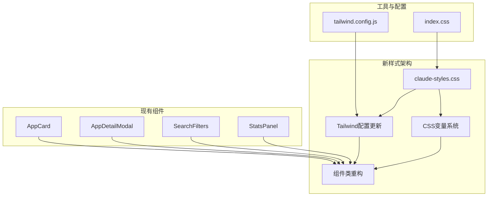
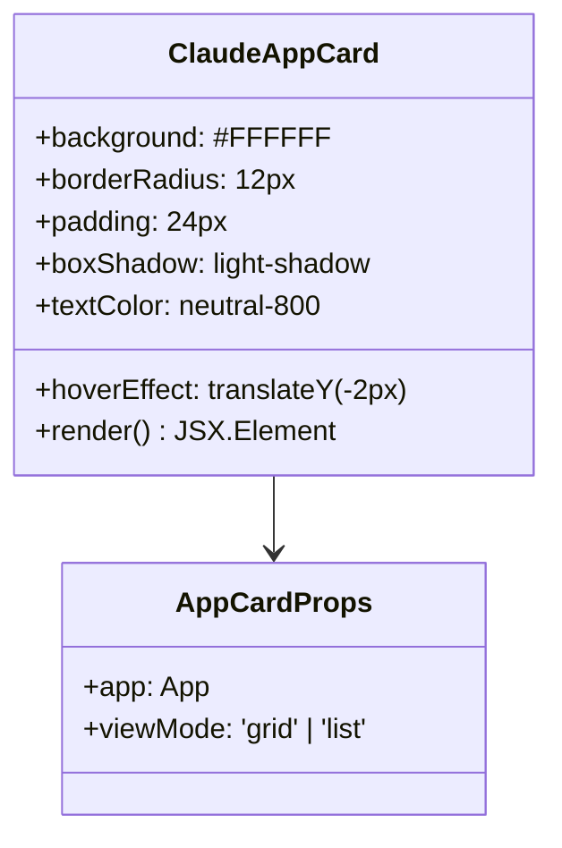
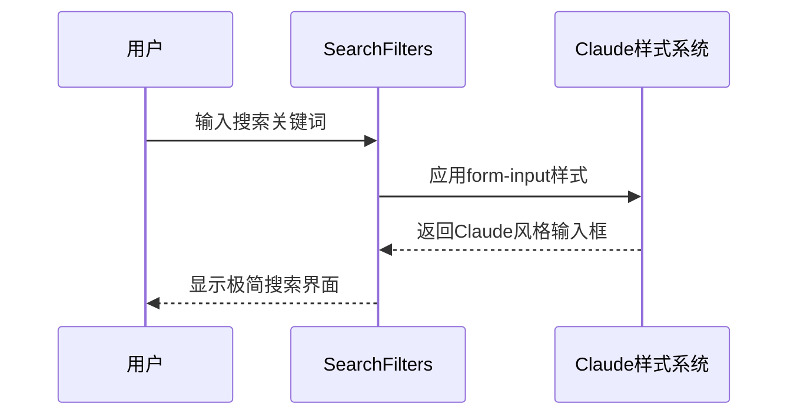
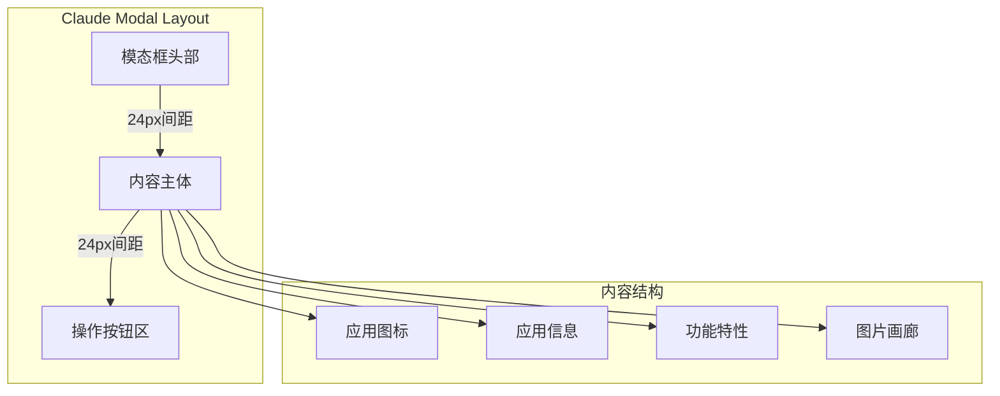
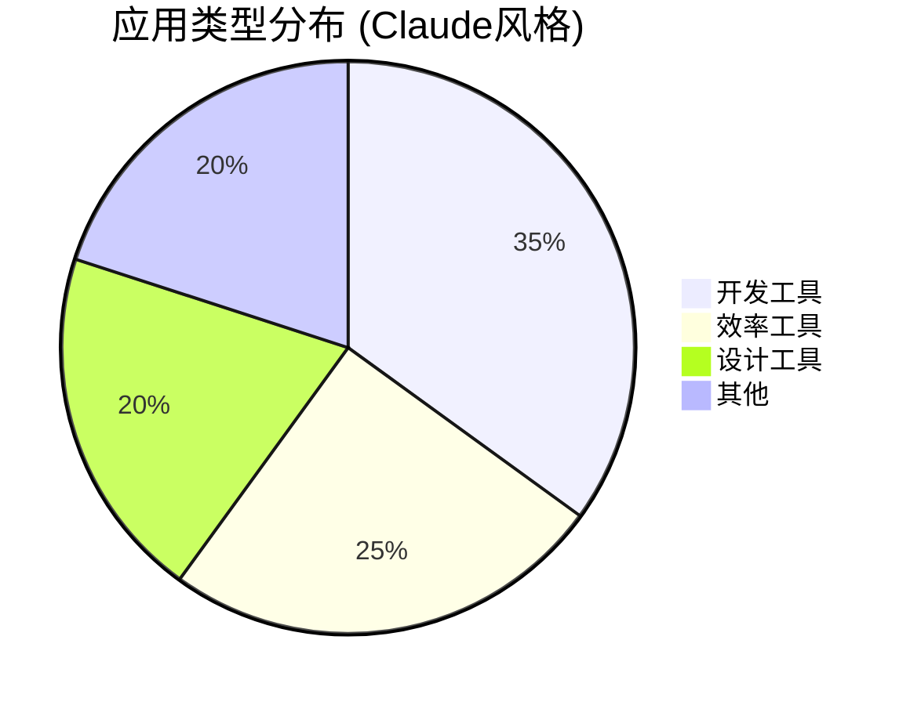
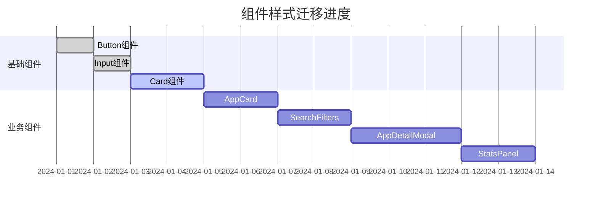
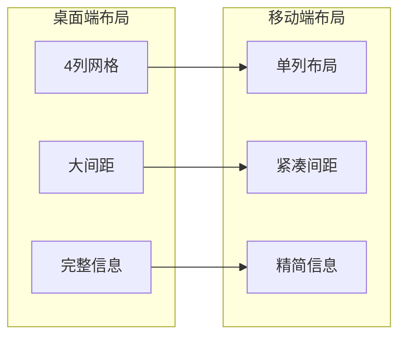
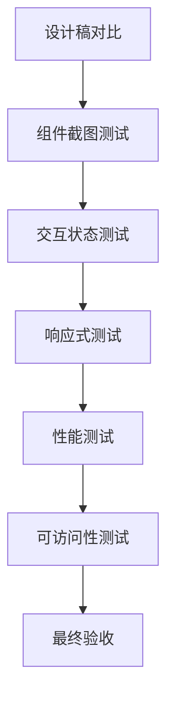

# Setapp Apps Showcase - 基于Claude设计系统的网页重新设计

## 概述

基于现有的Claude官网样式系统，对Setapp Apps Showcase网站进行全面的视觉重新设计。从当前的"现代化渐变风格"转向"极简主义温暖风格"，打造更加优雅、专业且易用的用户界面。

### 设计目标

- **极简主义风格**：采用Claude官网的极简设计理念，减少视觉噪音
- **温暖色调**：使用温暖的米白色背景和珊瑚色强调色，营造舒适体验
- **专业性提升**：通过统一的设计语言，提升整体专业度和品牌感知
- **用户体验优化**：保持现有功能完整性，优化视觉层次和交互体验

### 设计理念转变

| 当前设计 | Claude设计系统 |
|---------|---------------|
| 现代化渐变背景 | 纯净米白色背景 |
| 蓝紫色主色调 | 黑色+珊瑚色搭配 |
| 丰富的视觉效果 | 极简主义，大量留白 |
| 多种渐变色彩 | 统一的中性色系 |

## 技术架构

### 样式系统集成方案



### 文件结构调整

```
src/
├── styles/
│   ├── claude-styles.css          # Claude设计系统核心样式
│   ├── claude-variables.css       # CSS变量定义
│   └── components.css             # 组件特定样式
├── components/                    # 组件重新设计
│   ├── AppCard.tsx               # 卡片组件重构
│   ├── AppDetailModal.tsx        # 详情模态框重构
│   ├── SearchFilters.tsx         # 搜索过滤器重构
│   └── ...
└── assets/
    └── claude-theme.json          # 主题配置文件
```

## 组件架构重新设计

### AppCard组件改造

#### 设计变更对比

| 元素 | 当前设计 | Claude重新设计 |
|------|---------|---------------|
| 背景 | 白色+微阴影 | 纯白色+轻柔阴影 |
| 圆角 | 8px | 12px |
| 内边距 | 16px | 24px |
| 文字颜色 | 多色系 | 统一灰色系 |
| 悬停效果 | 轻微提升 | 向上2px+中等阴影 |



#### 样式类定义

```css
.claude-app-card {
  @apply bg-white rounded-xl p-6 border border-neutral-200;
  box-shadow: var(--shadow-light);
  transition: all var(--transition-slow);
}

.claude-app-card:hover {
  transform: translateY(-2px);
  box-shadow: var(--shadow-medium);
}
```

### SearchFilters组件改造

#### 设计特点

- **极简搜索栏**：采用Claude风格的输入框设计
- **柔和按钮**：使用轮廓按钮和文字按钮
- **清晰层次**：通过字体层级区分主次信息



### AppDetailModal组件改造

#### 布局重新设计



#### 样式特征

- **背景**：纯白色，无渐变
- **阴影**：重阴影效果 (--shadow-heavy)
- **圆角**：16px大圆角
- **间距**：使用Claude间距系统
- **字体**：应用完整的Claude字体层级

### StatsPanel组件改造

#### 数据可视化重新设计



#### 设计原则

- **极简图表**：减少装饰性元素，突出数据本身
- **柔和配色**：使用Claude色彩系统中的中性色
- **清晰标签**：应用Claude字体系统确保可读性

## 样式系统迁移策略

### CSS变量映射

| Claude变量 | 功能 | Tailwind对应 |
|-----------|------|-------------|
| --primary-background | 主背景 | bg-neutral-50 |
| --card-background | 卡片背景 | bg-white |
| --primary-text | 主文字 | text-neutral-800 |
| --secondary-text | 次要文字 | text-neutral-600 |
| --accent-coral | 强调色 | text-orange-600 |

### Tailwind配置更新

```javascript
// tailwind.config.js
module.exports = {
  theme: {
    extend: {
      colors: {
        // Claude色彩系统
        'claude-bg': '#FAFAF9',
        'claude-card': '#FFFFFF',
        'claude-text': '#2D2D2D',
        'claude-secondary': '#666666',
        'claude-accent': '#E07B5F',
        'claude-border': '#E5E5E5'
      },
      fontFamily: {
        'claude': ['-apple-system', 'BlinkMacSystemFont', 'Segoe UI', 'Roboto', 'sans-serif']
      },
      spacing: {
        // Claude间距系统
        'claude-xs': '4px',
        'claude-sm': '8px', 
        'claude-md': '16px',
        'claude-lg': '24px',
        'claude-xl': '32px'
      }
    }
  }
}
```

### 组件样式迁移清单



## 响应式设计优化

### 断点策略

```css
/* Claude响应式断点 */
@media (max-width: 1024px) {
  .claude-container {
    padding: 0 16px;
  }
  
  .claude-grid-4 {
    grid-template-columns: repeat(2, 1fr);
  }
}

@media (max-width: 768px) {
  .claude-grid-2, .claude-grid-3, .claude-grid-4 {
    grid-template-columns: 1fr;
    gap: 24px;
  }
  
  .claude-section {
    padding: 60px 0;
  }
}
```

### 移动端优化



## 状态管理优化

### 主题状态管理

```typescript
interface ClaudeThemeState {
  currentTheme: 'light' | 'dark';
  colorMode: 'claude-default' | 'claude-enhanced';
  compactMode: boolean;
  animationsEnabled: boolean;
}

const useClaudeTheme = create<ClaudeThemeState>((set) => ({
  currentTheme: 'light',
  colorMode: 'claude-default',
  compactMode: false,
  animationsEnabled: true,
  toggleCompactMode: () => set((state) => ({ 
    compactMode: !state.compactMode 
  })),
  setColorMode: (mode) => set({ colorMode: mode })
}));
```

### 组件状态模式

```mermaid
stateDiagram-v2
    [*] --> Default
    Default --> Hover: 用户悬停
    Default --> Focus: 用户聚焦
    Default --> Active: 用户点击
    
    Hover --> Default: 鼠标离开
    Focus --> Default: 失去焦点
    Active --> Default: 操作完成
    
    Default --> Loading: 数据加载
    Loading --> Default: 加载完成
    Loading --> Error: 加载失败
    Error --> Default: 重试成功
```

## API集成层优化

### 数据展示优化

```typescript
interface ClaudeDataPresentation {
  // 极简数据展示
  formatAppTitle: (title: string) => string;
  formatDescription: (desc: string) => string;
  formatPrice: (price: number) => string;
  formatRating: (rating: number) => JSX.Element;
}

// Claude风格的数据格式化
const claudeDataPresenter: ClaudeDataPresentation = {
  formatAppTitle: (title) => title.trim(),
  formatDescription: (desc) => 
    desc.length > 120 ? `${desc.substring(0, 120)}...` : desc,
  formatPrice: (price) => 
    price === 0 ? '免费' : `¥${price.toFixed(2)}`,
  formatRating: (rating) => (
    <div className="claude-rating">
      {Array.from({ length: 5 }, (_, i) => (
        <span key={i} className={i < rating ? 'star-filled' : 'star-empty'}>
          ★
        </span>
      ))}
    </div>
  )
};
```

## 测试策略

### 视觉回归测试



### 测试清单

- [ ] **颜色一致性**：所有组件使用Claude色彩系统
- [ ] **字体应用**：确保字体层级正确应用
- [ ] **间距统一**：使用Claude间距系统
- [ ] **响应式适配**：各断点下布局正常
- [ ] **交互反馈**：悬停、点击等状态符合Claude标准
- [ ] **可访问性**：颜色对比度达标，支持键盘导航
- [ ] **性能指标**：页面加载速度不低于当前版本
- [ ] **跨浏览器兼容**：主流浏览器正常显示

### 组件测试用例

```typescript
describe('Claude风格AppCard组件', () => {
  test('应用Claude背景色', () => {
    render(<AppCard app={mockApp} />);
    const card = screen.getByTestId('app-card');
    expect(card).toHaveClass('bg-white');
  });
  
  test('悬停效果符合Claude标准', () => {
    render(<AppCard app={mockApp} />);
    const card = screen.getByTestId('app-card');
    fireEvent.mouseEnter(card);
    expect(card).toHaveStyle('transform: translateY(-2px)');
  });
  
  test('文字颜色使用Claude系统', () => {
    render(<AppCard app={mockApp} />);
    const title = screen.getByText(mockApp.name);
    expect(title).toHaveClass('text-neutral-800');
  });
});
```