<div align="center">

# 🚀 Setapp Apps Showcase

[](https://reactjs.org/)
[](https://www.typescriptlang.org/)
[](https://vitejs.dev/)
[](https://tailwindcss.com/)
[](https://opensource.org/licenses/MIT)

**一个现代化的 Web 应用，专为浏览和探索 Setapp 应用商店中的优质应用而设计**

*支持多语言、多货币显示，提供智能搜索和数据可视化功能*

---

🌐 **[在线演示](https://duyananbryce.github.io/setapp-apps-showcase-modern/)** • 📖 **[项目文档](./docs/)** • 🛠️ **[开发指南](#-开发指南)**

---


</div>

## 📑 目录

<table>
<tr>
<td>

**🚀 快速开始**
- [✨ 功能特性](#-功能特性)
- [🛠️ 技术栈](#️-技术栈)
- [🚀 快速开始](#-快速开始)
- [🌐 部署](#-部署)

</td>
<td>

**📚 开发文档**
- [📁 项目结构](#-项目结构)
- [📊 数据源与处理](#-数据源与处理)
- [🛠️ 开发指南](#️-开发指南)
- [🤝 贡献指南](#-贡献指南)

</td>
<td>

**📋 其他信息**
- [📄 许可证](#-许可证)
- [🙏 致谢](#-致谢)
- [📈 更新日志](#-更新日志)
- [📞 联系我们](#-联系我们)

</td>
</tr>
</table>

## ✨ 功能特性

<div align="center">

### 🌟 核心亮点

</div>

<table>
<tr>
<td width="50%">

#### 🔍 智能搜索与过滤
- 🎯 **多维度搜索** - 按应用名称、描述、开发者实时搜索
- 🎛️ **高级过滤** - 平台、价格区间、评分多条件筛选
- ⚡ **快速排序** - 评分、价格、名称等多种排序方式

#### 📊 数据可视化
- 📈 **统计面板** - 实时显示关键指标和分布情况
- 📊 **图表展示** - 直观的数据图表展示市场趋势
- 🔄 **实时更新** - 筛选条件变化时数据同步更新

</td>
<td width="50%">

#### 🌍 国际化支持
- 🗣️ **多语言** - 支持中文、英文、日文三种语言
- 🤖 **智能翻译** - 40+热门应用个性化多语言描述
- 💰 **多货币** - USD、CNY、EUR、JPY、GBP 货币显示
- 🎯 **智能检测** - 自动根据地理位置设置默认选项

#### 🎨 现代化设计
- ✨ **极简风格** - 参考Claude官网的简洁优雅设计
- 📱 **响应式布局** - 完美适配各种设备屏幕
- 🎭 **流畅动画** - 平滑过渡效果和悬停反馈
- ♿ **无障碍设计** - 符合WCAG 2.1 AA级标准

</td>
</tr>
</table>

<div align="center">

#### ⚡ 性能优化

🚀 **快速加载** • 📦 **代码分割** • 🧠 **智能缓存** • 🔧 **翻译优化**

*基于Vite的极速构建，按需加载优化首屏时间，智能状态管理和高效多语言系统*

</div>

## 🛠️ 技术栈

<div align="center">

### 🏗️ 构建于现代化技术之上

</div>

<table>
<tr>
<td width="50%">

#### ⚛️ 前端核心
```
🔹 React 18.3.1      - 现代化UI框架
🔹 TypeScript 5.6.2  - 类型安全开发
🔹 Vite 6.0.1        - 极速构建工具
```

#### 🎨 UI & 样式
```
🎨 Tailwind CSS 3.4.17 - 实用优先CSS
🧩 Radix UI            - 高质量组件
🎯 Lucide React        - 精美图标库
```

</td>
<td width="50%">

#### 🗄️ 状态 & 数据
```
🐻 Zustand 5.0.2     - 轻量级状态管理
📊 Papa Parse 5.4.1  - 强大CSV解析器
🛣️ React Router v7   - 声明式路由
```

#### 🌍 国际化 & 工具
```
🗣️ i18next           - 国际化框架
⚛️ React i18next     - React国际化
🎛️ Clsx              - 条件类名工具
```

</td>
</tr>
</table>

<div align="center">

---

*精心选择的技术栈，确保开发效率和用户体验的完美平衡*

</div>

## 📁 项目结构

```
setapp-apps-showcase/
├── src/
│   ├── components/          # React组件
│   │   ├── AppCard.tsx         # 应用卡片组件
│   │   ├── AppDetailModal.tsx  # 应用详情模态框
│   │   ├── SearchFilters.tsx   # 搜索过滤器
│   │   ├── StatsPanel.tsx      # 统计面板
│   │   ├── FeatureGallery.tsx  # 功能展示
│   │   ├── PriceDisplay.tsx    # 价格显示
│   │   └── ...                 # 其他组件
│   ├── hooks/               # 自定义Hooks
│   │   └── useTheme.ts         # 主题管理Hook
│   ├── lib/                 # 工具库
│   │   ├── i18n.ts             # 国际化配置
│   │   ├── currency.ts         # 货币转换
│   │   └── utils.ts            # 通用工具函数
│   ├── pages/               # 页面组件
│   │   ├── Home.tsx            # 首页
│   │   └── TestPage.tsx        # 测试页面
│   ├── store/               # 状态管理
│   │   └── appStore.ts         # 应用状态存储
│   ├── types/               # TypeScript类型定义
│   │   └── app.ts              # 应用相关类型
│   ├── utils/               # 工具函数
│   │   ├── dataLoader.ts       # 数据加载器
│   │   ├── appFeatureExtractor.ts # 应用特性提取
│   │   └── appDescriptionTranslator.ts # 多语言描述翻译器
│   ├── App.tsx              # 应用根组件
│   ├── main.tsx             # 应用入口
│   └── index.css            # 全局样式
├── public/                  # 静态资源
│   ├── icon/                   # 应用图标
│   ├── apps_list_enhanced_descriptions.csv # 应用数据
│   └── favicon.svg             # 网站图标
├── scripts/                 # 数据处理脚本
│   ├── setapp_scraper_ultimate.py     # 终极爬虫脚本
│   ├── enhanced_html_parser.py        # HTML解析器
│   ├── merge_csv_data.py              # 数据合并工具
│   └── setapp_description_enhancer.py # 描述增强器
├── docs/                    # 项目文档
│   ├── IMPLEMENTATION_SUMMARY.md      # 实现总结
│   ├── LANGUAGE_CURRENCY_FIX_SUMMARY.md # 多语言修复说明
│   └── SMART_FEATURE_EXTRACTION_SUMMARY.md # 智能特征提取说明
├── archive/                 # 归档文件
│   ├── apps_list_*.csv         # 历史数据文件
│   ├── *.cjs                   # 测试脚本
│   └── *.png                   # 截图文件
└── package.json             # 项目配置
```

## 🚀 快速开始

<div align="center">

### ⚡ 三步启动项目

</div>

<table>
<tr>
<td width="30%" align="center">

#### 📋 环境要求

```bash
Node.js >= 18.0.0
npm >= 9.0.0
Git (版本控制)
```

</td>
<td width="70%">

#### 🛠️ 安装与运行

```bash
# 1️⃣ 克隆项目
git clone https://github.com/duyananbryce/setapp-apps-showcase-modern.git
cd setapp-apps-showcase

# 2️⃣ 安装依赖
npm install

# 3️⃣ 启动开发服务器
npm run dev
```

🎉 **完成！** 打开浏览器访问 [http://localhost:5173](http://localhost:5173)

</td>
</tr>
</table>

<div align="center">

#### 🔧 常用命令

| 命令 | 说明 | 用途 |
|------|------|------|
| `npm run dev` | 🚀 启动开发服务器 | 本地开发调试 |
| `npm run build` | 📦 构建生产版本 | 部署前构建 |
| `npm run preview` | 👀 预览构建结果 | 本地测试构建 |
| `npm run lint` | 🔍 代码检查 | 代码质量检查 |
| `npm run deploy:gh-pages` | 🌐 部署到GitHub Pages | 一键部署 |

</div>

## 📊 数据源与处理

### 数据来源
- **主数据源**：Setapp官方应用商店数据
- **数据格式**：CSV格式，包含应用名称、描述、评分、价格、图标等信息
- **更新频率**：根据需要手动更新

### 数据处理流程
1. **数据抓取**：使用Python脚本从Setapp官网抓取最新应用信息
2. **数据清洗**：清理和标准化应用数据格式
3. **描述增强**：使用AI技术增强应用功能描述
4. **数据合并**：将多个数据源合并为统一格式
5. **智能分类**：自动提取应用类型和核心功能

### 使用数据处理脚本

```bash
# 安装Python依赖
pip install requests beautifulsoup4 pandas

# 运行数据抓取脚本
python scripts/setapp_scraper_ultimate.py

# 增强应用描述
python scripts/setapp_description_enhancer.py

# 合并数据文件
python scripts/merge_csv_data.py
```

## 🌐 部署

<div align="center">

### 🚀 多平台部署支持

[](https://docker.com)
[](https://duyananbryce.github.io/setapp-apps-showcase-modern/)
[](https://vercel.com)
[](https://netlify.com)

**🌟 [立即访问在线演示](https://duyananbryce.github.io/setapp-apps-showcase-modern/)**

</div>

---

### 🐳 Docker 部署

<div align="center">

#### 🚀 容器化部署，一次构建，到处运行

[](https://hub.docker.com)

</div>

<table>
<tr>
<td width="50%">

#### 📦 快速启动
```bash
# 构建镜像
docker build -t setapp-showcase .

# 运行容器
docker run -d -p 3000:8080 \
  --name setapp-showcase \
  --restart unless-stopped \
  setapp-showcase

# 查看运行状态
docker ps
docker logs setapp-showcase
```

#### 🔧 多阶段构建
```dockerfile
# 构建阶段
FROM node:18-alpine AS builder
WORKDIR /app
COPY package*.json ./
RUN npm ci --only=production
COPY . .
RUN npm run build

# 生产阶段
FROM nginx:alpine AS production
COPY --from=builder /app/dist /usr/share/nginx/html
COPY nginx.conf /etc/nginx/nginx.conf
RUN addgroup -g 1001 -S nodejs && \
    adduser -S nextjs -u 1001
EXPOSE 8080
HEALTHCHECK --interval=30s --timeout=3s --retries=3 \
    CMD curl -f http://localhost:8080/ || exit 1
CMD ["nginx", "-g", "daemon off;"]
```

</td>
<td width="50%">

#### 🐙 Docker Compose
```yaml
version: '3.8'
services:
  setapp-showcase:
    build:
      context: .
      dockerfile: Dockerfile
    container_name: setapp-showcase-app
    ports:
      - "3000:8080"
    environment:
      - NODE_ENV=production
    restart: unless-stopped
    healthcheck:
      test: ["CMD", "curl", "-f", "http://localhost:8080/health"]
      interval: 30s
      timeout: 10s
      retries: 3
```

```bash
# 生产环境启动
docker-compose up -d

# 开发环境启动（热重载）
docker-compose --profile dev up -d

# 查看日志
docker-compose logs -f setapp-showcase

# 停止服务
docker-compose down
```

#### ⚙️ 环境变量配置
```bash
# 生产环境
NODE_ENV=production
VITE_HOST=0.0.0.0
VITE_PORT=8080

# 开发环境
NODE_ENV=development
VITE_HOST=0.0.0.0
VITE_PORT=5173
```

#### 🔧 常用命令
```bash
# 构建并启动
docker-compose up --build -d

# 重启服务
docker-compose restart

# 查看容器状态
docker-compose ps

# 进入容器
docker-compose exec setapp-showcase sh

# 清理资源
docker-compose down --volumes --rmi all
```

</td>
</tr>
</table>

---

### 📡 GitHub Pages 部署

<table>
<tr>
<td width="50%">

#### ⚡ 自动部署
```bash
# GitHub Actions 自动触发
git push origin main
```
✨ **推送到 main 分支即可自动部署**

#### 🔧 手动部署
```bash
# 一键部署
npm run deploy:gh-pages

# 或分步执行
npm run build
npx gh-pages -d dist
```

</td>
<td width="50%">

#### 📊 部署状态

| 项目 | 状态 | 链接 |
|------|------|------|
| **生产环境** | ✅ 在线 | [访问站点](https://duyananbryce.github.io/setapp-apps-showcase-modern/) |
| **构建状态** | ✅ 通过 | GitHub Actions |
| **最后更新** | 🕐 实时 | 自动同步 |

#### 🎯 访问地址
```
https://duyananbryce.github.io/setapp-apps-showcase-modern/
```

</td>
</tr>
</table>

---

### 🔷 Vercel 部署

<div align="center">

#### 🚀 一键部署到 Vercel

[](https://vercel.com/new/clone?repository-url=https://github.com/duyananbryce/setapp-apps-showcase-modern)

</div>

<table>
<tr>
<td width="50%">

#### 🔗 GitHub 自动部署
1. 在 [Vercel](https://vercel.com) 中导入 GitHub 仓库
2. Vercel 自动检测 Vite 项目配置
3. 每次推送代码自动重新部署

#### ⚙️ 构建配置
```
Framework Preset: Vite
Build Command: npm run build
Output Directory: dist
Node.js Version: 18.x
```

</td>
<td width="50%">

#### 💻 CLI 部署
```bash
# 安装 Vercel CLI
npm i -g vercel

# 登录账户
vercel login

# 部署到生产环境
vercel --prod
```

#### ✨ 特性支持
- 🔄 自动 HTTPS
- 🌍 全球 CDN
- 📊 性能分析
- 🔧 环境变量管理

</td>
</tr>
</table>

---

### 🟢 Netlify 部署

<table>
<tr>
<td width="50%">

#### 📁 拖拽部署
```bash
# 构建项目
npm run build

# 将 dist 目录拖拽到 Netlify Drop
# https://app.netlify.com/drop
```

#### 🔗 Git 集成部署
1. 连接 GitHub 仓库到 Netlify
2. 配置构建设置
3. 自动部署和预览

</td>
<td width="50%">

#### 💻 CLI 部署
```bash
# 安装 Netlify CLI
npm i -g netlify-cli

# 登录账户
netlify login

# 部署到生产环境
netlify deploy --prod --dir=dist
```

#### 🎯 构建配置
```toml
[build]
  command = "npm run build"
  publish = "dist"
```

</td>
</tr>
</table>

---

### 🏠 自托管部署

<table>
<tr>
<td width="50%">

#### 🐳 Docker 部署
```dockerfile
FROM nginx:alpine
COPY dist/ /usr/share/nginx/html/
EXPOSE 80
CMD ["nginx", "-g", "daemon off;"]
```

```bash
# 构建镜像
docker build -t setapp-showcase .

# 运行容器
docker run -p 80:80 setapp-showcase
```

</td>
<td width="50%">

#### 🖥️ 传统服务器
```bash
# 构建项目
npm run build

# 上传到服务器
rsync -av dist/ user@server:/var/www/html/

# 或使用 SCP
scp -r dist/* user@server:/var/www/html/
```

#### ⚙️ Nginx 配置
```nginx
server {
    listen 80;
    root /var/www/html;
    index index.html;
    
    location / {
        try_files $uri $uri/ /index.html;
    }
}
```

</td>
</tr>
</table>

---

### 🧪 本地部署测试

```bash
# 构建生产版本
npm run build

# 方式一：使用 Vite 预览（推荐）
npm run preview

# 方式二：使用 serve
npx serve dist -p 3000

# 方式三：使用 Python
python -m http.server 8000 -d dist

# 方式四：使用 Node.js
npx http-server dist -p 3000
```

<div align="center">

---

*🎉 选择最适合你的部署方式，享受现代化的部署体验！*

**💡 推荐顺序：** GitHub Pages → Vercel → Netlify → 自托管

</div>

## 🛠️ 开发指南

<div align="center">

### 👨‍💻 为开发者精心准备的完整指南

</div>

---

### 🏗️ 项目架构

<table>
<tr>
<td width="50%">

#### 📁 目录结构
```
src/
├── 🧩 components/      # 可复用组件
│   ├── ui/            # 基础UI组件
│   ├── layout/        # 布局组件
│   └── features/      # 功能组件
├── 🪝 hooks/          # 自定义Hook
├── 🗄️ stores/         # Zustand状态管理
├── 🔧 utils/          # 工具函数
├── 📝 types/          # TypeScript类型
├── 📊 data/           # 静态数据文件
└── 🌍 locales/        # 国际化文件
```

</td>
<td width="50%">

#### 🎯 设计原则

- **🔒 类型安全**：全面使用 TypeScript
- **🧩 组件化**：高度可复用的组件设计
- **📱 响应式**：移动优先的设计理念
- **🚀 性能优化**：代码分割和懒加载
- **🌍 国际化**：多语言支持
- **♿ 可访问性**：遵循 WCAG 标准

#### 🛠️ 核心技术
```
⚛️ React 18 + TypeScript
🎨 Tailwind CSS + Radix UI
🐻 Zustand 状态管理
🛣️ React Router v7
⚡ Vite 构建工具
```

</td>
</tr>
</table>

---

### 📋 开发规范

<table>
<tr>
<td width="33%">

#### 🎨 代码风格
```typescript
// ✅ 推荐
interface UserProps {
  name: string;
  age: number;
}

const UserCard: FC<UserProps> = ({ 
  name, 
  age 
}) => {
  return (
    <div className="p-4 rounded-lg">
      <h3>{name}</h3>
      <p>Age: {age}</p>
    </div>
  );
};
```

</td>
<td width="33%">

#### 📝 命名规范
| 类型 | 规范 | 示例 |
|------|------|------|
| 组件 | PascalCase | `UserCard.tsx` |
| Hook | use + PascalCase | `useUserData.ts` |
| 工具函数 | camelCase | `formatDate.ts` |
| 常量 | UPPER_SNAKE_CASE | `API_BASE_URL` |
| 类型 | PascalCase | `UserType` |

</td>
<td width="33%">

#### 📦 Git 提交规范
```bash
# 功能开发
feat: 添加用户搜索功能

# 问题修复
fix: 修复搜索结果显示问题

# 文档更新
docs: 更新API文档

# 样式调整
style: 优化按钮样式

# 代码重构
refactor: 重构用户组件

# 测试相关
test: 添加用户组件测试

# 构建相关
chore: 更新依赖版本
```

</td>
</tr>
</table>

---

### 🔄 开发工作流

<div align="center">

#### 🚀 标准开发流程

```mermaid
graph LR
    A[创建分支] --> B[本地开发]
    B --> C[代码检查]
    C --> D[构建测试]
    D --> E[提交代码]
    E --> F[创建PR]
    F --> G[代码审查]
    G --> H[合并主分支]
```

</div>



<table>
<tr>
<td width="50%">

#### 🌿 分支管理
```bash
# 创建功能分支
git checkout -b feature/user-search

# 创建修复分支
git checkout -b fix/search-bug

# 创建文档分支
git checkout -b docs/api-update
```

#### 🧪 开发测试
```bash
# 启动开发服务器
npm run dev

# 代码质量检查
npm run lint
npm run type-check

# 构建生产版本
npm run build

# 预览构建结果
npm run preview
```

</td>
<td width="50%">

#### 📤 提交流程
```bash
# 暂存更改
git add .

# 提交更改（遵循规范）
git commit -m "feat: add user search functionality"

# 推送到远程分支
git push origin feature/user-search

# 在 GitHub 创建 Pull Request
# 等待代码审查和合并
```

#### ✅ 质量检查清单
- [ ] 🔍 代码通过 ESLint 检查
- [ ] 📝 TypeScript 类型检查通过
- [ ] 🏗️ 构建成功无错误
- [ ] 📱 响应式设计测试
- [ ] ♿ 可访问性检查
- [ ] 🌍 多语言支持测试

</td>
</tr>
</table>

---

### ⚡ 性能优化

<table>
<tr>
<td width="50%">

#### 🚀 代码优化
```typescript
// ✅ 代码分割
const LazyComponent = lazy(() => 
  import('./components/HeavyComponent')
);

// ✅ 缓存优化
const memoizedValue = useMemo(() => 
  expensiveCalculation(data), [data]
);

const memoizedCallback = useCallback(() => {
  doSomething(a, b);
}, [a, b]);

// ✅ 组件优化
const OptimizedComponent = memo(Component);
```

</td>
<td width="50%">

#### 📊 性能监控
```bash
# 包大小分析
npm run build
npm run analyze

# 性能测试
npm run lighthouse

# 依赖分析
npm run bundle-analyzer
```

#### 🎯 优化建议
- 🖼️ **图片优化**：使用 WebP/AVIF 格式
- 📦 **代码分割**：按路由和功能分割
- 🗄️ **缓存策略**：合理使用浏览器缓存
- 🔄 **懒加载**：非关键资源延迟加载
- 📱 **移动优化**：优先考虑移动端性能

</td>
</tr>
</table>

---

### 🐛 调试技巧

<div align="center">

#### 🔧 开发者工具箱

</div>

<table>
<tr>
<td width="33%">

#### 🛠️ 浏览器工具
- **React DevTools**
  - 组件树查看
  - Props 和 State 检查
  - 性能分析

- **Chrome DevTools**
  - 网络请求监控
  - 性能分析
  - 内存使用情况

</td>
<td width="33%">

#### 📝 代码调试
```typescript
// 条件断点
if (user.id === 'debug') {
  debugger;
}

// 性能测量
console.time('render');
// ... 代码执行
console.timeEnd('render');

// 状态日志
console.log('State:', state);
```

</td>
<td width="33%">

#### 🧪 测试调试
```bash
# 运行测试
npm run test

# 监听模式
npm run test:watch

# 覆盖率报告
npm run test:coverage

# E2E 测试
npm run test:e2e
```

</td>
</tr>
</table>

<div align="center">

---

*💡 **提示**：善用开发工具，让调试变得更加高效！*

**🔗 有用链接：**
[React DevTools](https://react.dev/learn/react-developer-tools) • 
[Vite 文档](https://vitejs.dev/) • 
[Tailwind CSS](https://tailwindcss.com/) • 
[TypeScript 手册](https://www.typescriptlang.org/docs/)

</div>

## 🤝 贡献指南

我们欢迎所有形式的贡献！请查看我们的贡献指南：

1. **Fork** 本仓库
2. **创建**特性分支 (`git checkout -b feature/AmazingFeature`)
3. **提交**更改 (`git commit -m 'Add some AmazingFeature'`)
4. **推送**到分支 (`git push origin feature/AmazingFeature`)
5. **创建** Pull Request

## 📄 许可证

本项目基于 [MIT 许可证](LICENSE) 开源。

## 🙏 致谢

- [Setapp](https://setapp.com) - 提供优质的macOS应用数据
- [React团队](https://reactjs.org) - 出色的前端框架
- [Tailwind CSS](https://tailwindcss.com) - 强大的CSS框架
- [Vite](https://vitejs.dev) - 快速的构建工具

## 📈 更新日志

### v2.1.0 (2025-01-30)
- ✨ **新增**：智能多语言描述翻译系统
- 🔧 **优化**：为40+热门应用添加个性化英日描述
- 🐛 **修复**：APP_NAME_TO_TYPE对象重复键值问题
- ⚡ **改进**：关键词匹配算法，提升翻译准确性
- 🎨 **更新**：UI设计文档和样式规范

### v2.0.0 (2025-01-29)
- 🚀 **重构**：全新的现代化UI设计
- 🌍 **新增**：多语言和多货币支持
- 📊 **新增**：数据可视化统计面板
- 🔍 **增强**：智能搜索和过滤功能

## 📞 联系我们

如有问题或建议，请通过以下方式联系：

- 📧 邮箱：[your-email@example.com]
- 🐛 问题反馈：请通过项目Issues页面反馈
- 💬 讨论：欢迎在项目中提出建议和讨论

---

<div align="center">
  <p>用 ❤️ 制作于 2025</p>
  <p>如果这个项目对您有帮助，请给我们一个 ⭐</p>
</div>
